# Linux Troubleshooting Drill (Docker)

> **Goal:** Build a repeatable, production-style troubleshooting routine covering CPU, memory, disk, network, and logs.

---

## Target Service

* **Service:** docker
* **Main process:** dockerd
* **Environment:** Ubuntu 24.04.1 LTS on WSL2

---

## 1. Environment Basics

### 1.1 Kernel & system info

```bash
uname -a
```

**Output / Screenshot:**


---

### 1.2 OS details

```bash
lsb_release -a
```

```bash
cat /etc/os-release
```

**Output / Screenshot:**


**Notes:**

* Confirm OS version is supported and not EOL
* WSL2 kernel behaves differently from bare metal (important for IO & networking)

---

## 2. Filesystem Sanity Check

```bash
mkdir /tmp/runbook-demo
cp /etc/hosts /tmp/runbook-demo/hosts-copy-file
ls -l /tmp/runbook-demo
```

**Output / Screenshot:**

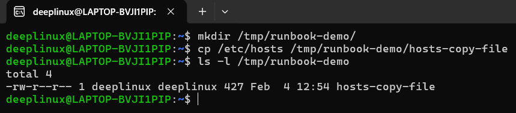


**Notes:**

* Confirms disk is writable
* Rules out basic filesystem or permission issues

---

## 3. CPU & Memory Snapshot

### 3.1 Overall system usage

```bash
top
```

**Output / Screenshot:**

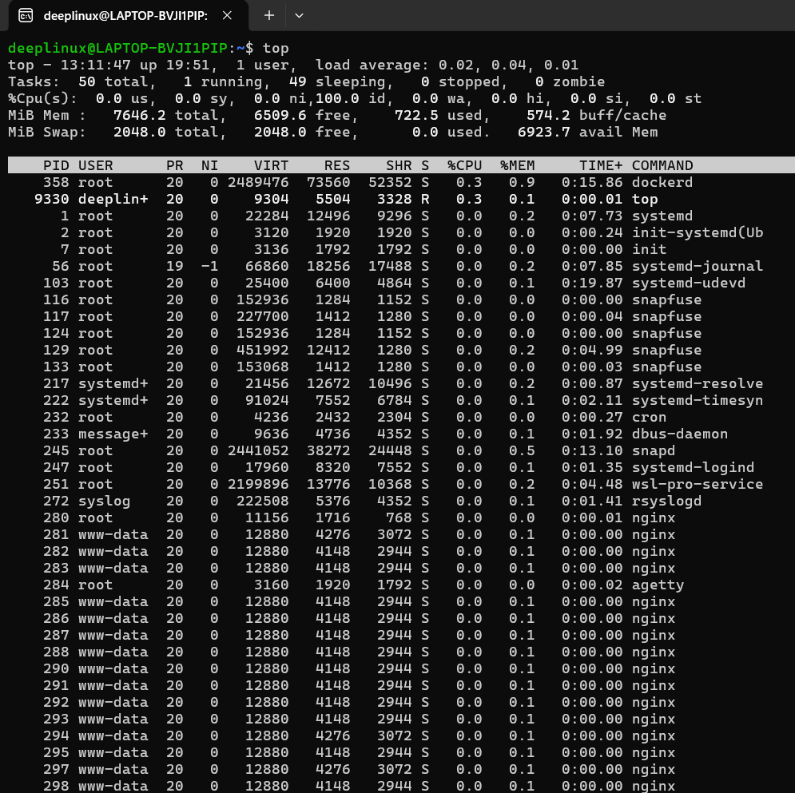


**What to check:**

* Load average
* dockerd CPU usage
* Idle CPU percentage

---

### 3.2 Process-level usage

```bash
ps aux | grep dockerd
ps -o pid,pcpu,pmem,comm -p $(pidof dockerd)
```

**Output / Screenshot:**

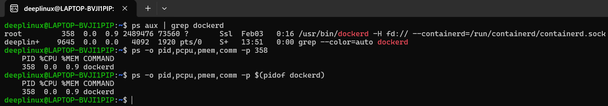


**Notes:**

* Confirms which PID is dockerd
* Validates CPU & memory consumption

---

### 3.3 Memory availability

```bash
free -h
```

**Output / Screenshot:**

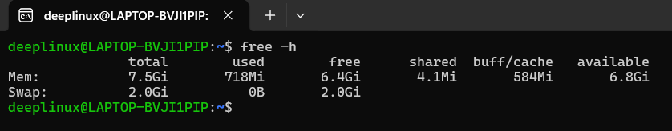


**Notes:**

* Check available memory
* Ensure swap is not heavily used

---

## 4. Disk & IO Health

### 4.1 Disk usage

```bash
df -h
```

**Output / Screenshot:**

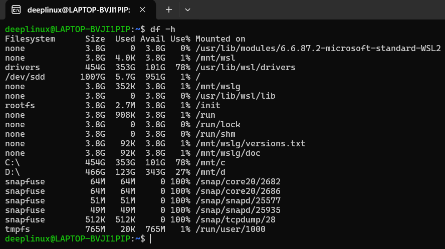


**Notes:**

* Ignore snapfs 100% usage (expected)
* Focus on root filesystem and /var

---

### 4.2 Log directory size

```bash
sudo du -sh /var/log
```

**Output / Screenshot:**

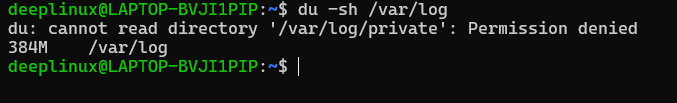

**Notes:**

* Large log growth can cause disk pressure
* Verify log rotation is working

---

### 4.3 IO statistics

```bash
iostat
vmstat 1
vmstat 1 5
dstat -cdnm
```

**Output / Screenshot:**

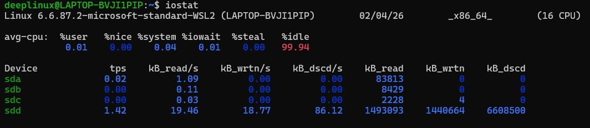
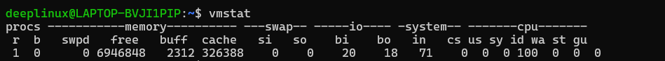
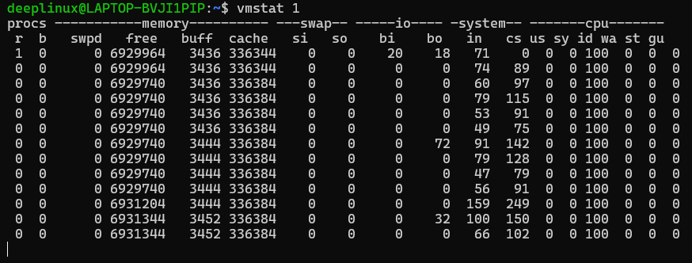

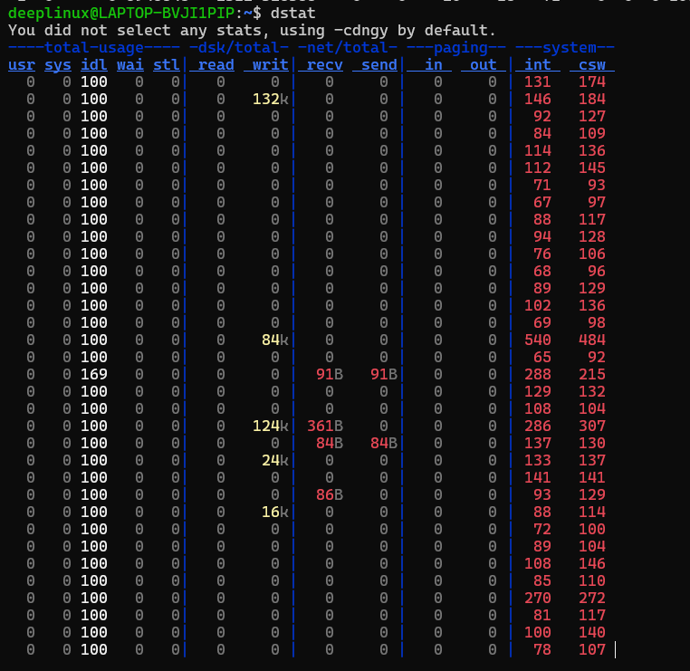
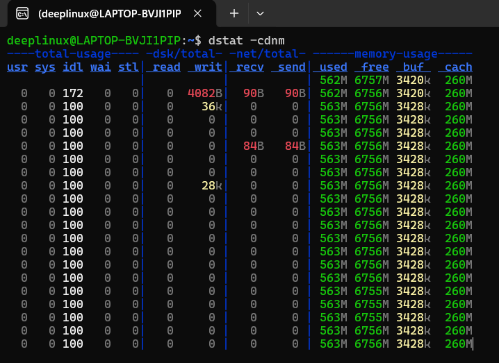


**Notes:**

* Check IO wait
* Ensure no swap-in or swap-out activity

---

## 5. Network Checks

### 5.1 Listening sockets

```bash
sudo ss -tulpn | grep docker
sudo ss -lx | grep docker
```

**Output / Screenshot:**

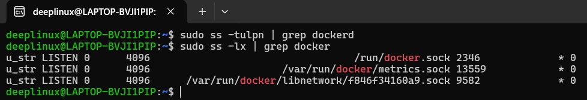


**Notes:**

* Docker should listen only on Unix sockets
* No unexpected exposed TCP ports

---

### 5.2 Docker API health

```bash
curl --unix-socket /var/run/docker.sock http://localhost/_ping
```

**Output / Screenshot:**

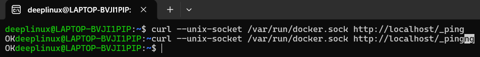


**Expected:** `OK`

---

## 6. Log Analysis

### 6.1 Docker service logs

```bash
journalctl -u docker -n 50
```

**Output / Screenshot:**

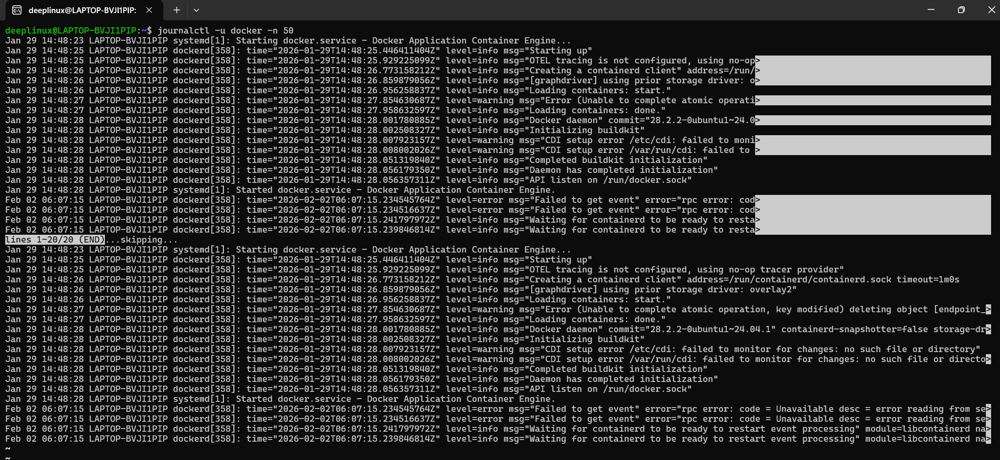


**Notes:**

* Look for crash loops or repeated restarts
* Warnings are acceptable if service is stable

---

### 6.2 System logs

```bash
tail -n 50 /var/log/syslog
```

**Output / Screenshot:**

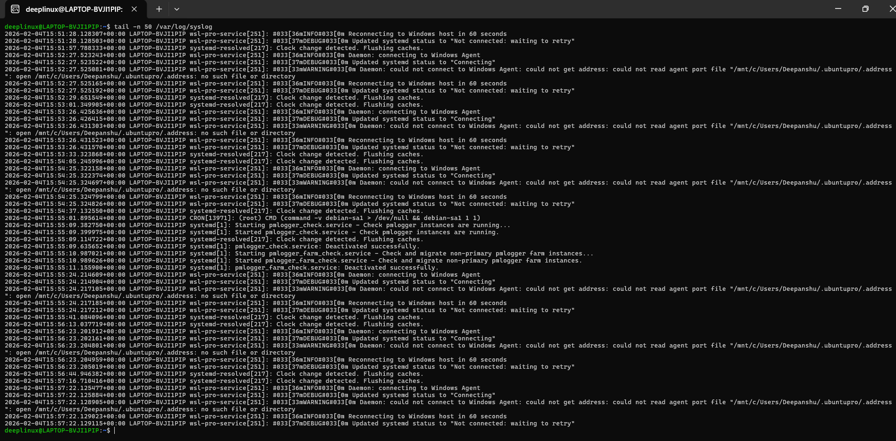


**Notes:**

* WSL-related warnings are expected
* Confirm no docker-related fatal errors

---

## 7. Quick Findings

* System is healthy and mostly idle
* dockerd resource usage is minimal
* No CPU, memory, disk, or IO pressure
* Docker responding correctly to API checks
* Observed warnings are non-fatal

---

## 8. If This Worsens (Next Steps)

1. **Immediate containment**

```bash
systemctl restart docker
```

2. **Deeper diagnostics**

```bash
docker stats
dockerd --debug
```

3. **Advanced troubleshooting**

* Inspect container logs
* Capture `strace` on dockerd
* Review container restart behavior

---

## Status

✅ Day-05 Linux Troubleshooting Drill completed

This runbook can be reused during real incidents and extended for other services (nginx, ssh, databases).
