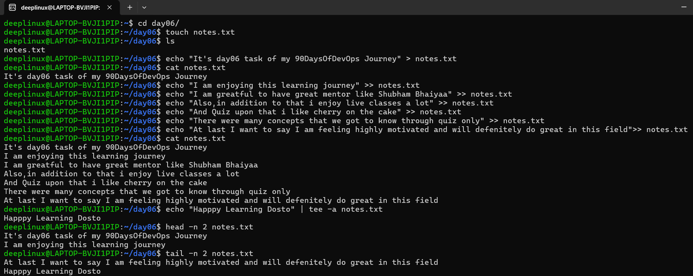

# Day 06 – Linux File Read & Write Practice

## Overview
On Day 06 of the **90DaysOfDevOps** journey, I practiced basic Linux file input/output operations.
The focus was on creating files, writing data, appending content, and reading files using fundamental Linux commands.

These operations are commonly used while working with logs, configuration files, and scripts in real DevOps environments.

---

## Commands Used and Explanation

### 1. Create an empty file
```bash
touch notes.txt
Creates an empty file named notes.txt if it does not already exist.

2. Write data to a file (overwrite mode)
echo "It's day06 task of my 90DaysOfDevOps Journey" > notes.txt


Writes content to the file.
If the file already has data, it will be overwritten.

3. Append data to a file
echo "I am enjoying this learning journey" >> notes.txt


Appends a new line to the existing content without deleting previous data.

4. Write and display output using tee
echo "Happy Learning Dosto" | tee -a notes.txt


Displays the output on the terminal and appends it to the file at the same time.

5. Read the complete file
cat notes.txt


Displays the full contents of the file.

6. Read the first few lines of the file
head -n 2 notes.txt


Displays the first 2 lines of the file.

7. Read the last few lines of the file
tail -n 2 notes.txt


Displays the last 2 lines of the file.

Key Learnings

> is used to overwrite file content

>> is used to append content safely

tee is useful when output needs to be viewed and saved together

Reading partial files helps when analyzing large logs

Conclusion

This exercise helped reinforce basic Linux file handling skills, which are essential for daily DevOps tasks such as log analysis, configuration management, and automation scripting.

📎 Command outputs and screenshots have been attached for reference and verification.
