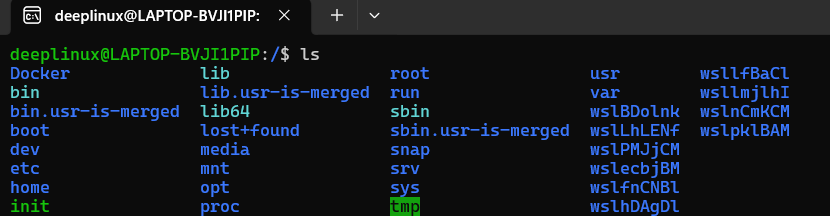
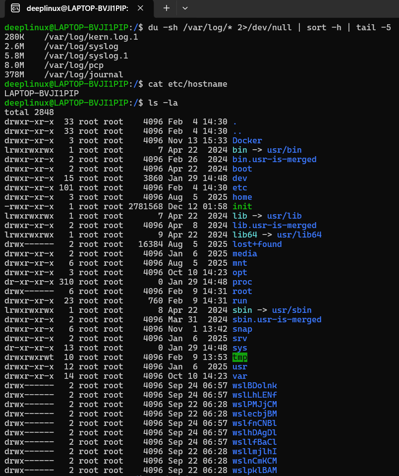

# Day 07 – Linux File System Hierarchy & Scenario-Based Practice

## Objective
Understand where critical files live in Linux and practice troubleshooting like a DevOps engineer.  
Focus is on **real-world usage**, not theory.


## Part 1: Linux File System Hierarchy

Linux uses a **single-root hierarchy**. Everything starts at `/`.


### `/` (Root)

**Purpose:**  
Top-level directory. All files and directories exist under this path.

**Observed (`ls -l /`):**  
`bin`, `sbin`, `etc`, `home`, `usr`, `var`, `tmp`, `root`

**I would use this when:**  
I need to understand system structure or verify mounted filesystems.

---

### `/home`

**Purpose:**  
Home directories for non-root users.

**Observed (`ls -l /home`):**  
`ubuntu`, `ec2-user`

**I would use this when:**  
Managing user files, SSH keys, or application source code.

---

### `/root`

**Purpose:**  
Home directory for the root user.

**Observed (`ls -l /root`):**  
`.bashrc`, `.ssh/`

**I would use this when:**  
Running admin-only scripts or storing root-level SSH keys.

---

### `/etc`

**Purpose:**  
System-wide configuration files.

**Observed (`ls -l /etc`):**  
`hostname`, `hosts`, `ssh/`, `systemd/`

**I would use this when:**  
Configuring services, networking, users, or system startup.

⚠️ Editing files here can immediately break services.

---

### `/var/log`

**Purpose:**  
System and application log files.

**Observed (`ls -l /var/log`):**  
`syslog`, `auth.log`, `journal/`

**I would use this when:**  
Troubleshooting service failures, login issues, or crashes.

---

### `/tmp`

**Purpose:**  
Temporary files. Usually cleared on reboot.

**Observed (`ls -l /tmp`):**  
Temporary app files and sockets

**I would use this when:**  
Storing short-lived debugging or temporary data.

⚠️ Never store important data here.

---

### `/bin`

**Purpose:**  
Essential command binaries required for system operation.

**Observed (`ls -l /bin`):**  
`ls`, `cp`, `mv`, `rm`, `bash`

**I would use this when:**  
Running basic Linux commands, even in rescue mode.

---

### `/sbin`

**Purpose:**  
System administration binaries (mainly for root).

**Observed (`ls -l /sbin`):**  
`ip`, `reboot`, `fsck`, `mount`

**I would use this when:**  
Managing networking, disks, filesystems, or system recovery.

🧠 Most commands here require root privileges.

---

### `/usr/bin`

**Purpose:**  
User-level binaries and installed tools.

**Observed (`ls -l /usr/bin`):**  
`vim`, `curl`, `git`, `python3`

**I would use this when:**  
Running development tools or automation scripts.

---

### `/opt`

**Purpose:**  
Optional or third-party software installations.

**Observed (`ls -l /opt`):**  
Vendor or custom application directories

**I would use this when:**  
Installing external software without touching system directories.

---


### Hands-On Commands & Evidence

As part of this task, I executed the following commands on the system to validate my understanding of the Linux filesystem and to practice real-world troubleshooting.

**Find largest log files**
```bash
du -sh /var/log/* 2>/dev/null | sort -h | tail -5
```

**View system hostname**
```bash
cat /etc/hostname
```

**Inspect home directory**
```bash
ls -la ~
```
### 📸 Evidence (Screenshot Attached):
The outputs of all the above commands were captured together in a single terminal session and are attached as one combined screenshot.




---

## Part 2: Scenario-Based Practice

The goal of this section is to practice **structured troubleshooting**.  
For each scenario, I focused on *what to check first, what to check next, and why*.


## Scenario 1: Service Not Starting After Reboot ##

**Problem:**  
A web application service called `myapp` failed to start after a server reboot.

### Step-by-step Diagnosis

**Step 1: Check service status**

```bash
systemctl status myapp
```

**Why:**
This tells me whether the service is running, failed, stopped, or not found.

**Step 2: Check recent service logs**

```bash
journalctl -u myapp -n 50
```

**Why:**
Logs usually explain why the service failed (config error, missing dependency, permission issue).

**Step 3: Check if the service is enabled on boot**

```bash
systemctl is-enabled myapp
```

**Why:**
If disabled, the service will not start automatically after reboot.

**Step 4: List all services if not found**

```bash
systemctl list-units --type=service
```

**Why:**
Confirms whether the service exists and if the name is correct.

**What I learned:**
Always check status first, then logs, then boot configuration. Guessing wastes time.

---

## Scenario 2: High CPU Usage ##

**Problem:**
The application server feels slow and unresponsive.

### Step-by-step Diagnosis ###

**Step 1: Check live CPU usage**

```bash
top
```

**Why:**
Shows real-time CPU usage and which processes are consuming the most resources.

**Step 2: Identify top CPU-consuming processes**

```bash
ps aux --sort=-%cpu | head -10
```

**Why:**
Provides a sorted list of processes using the most CPU, making it easier to identify the culprit.

**Step 3: Note the PID of the problematic process**

```bash
ps -p <PID> -o pid,ppid,cmd,%cpu,%mem
```

**Why:**
Helps understand what the process is doing and whether it belongs to the application.

**What I learned:**
Always identify the process before taking action. Killing processes blindly is dangerous.

---

## Scenario 3: Finding Service Logs (systemd) ##

**Problem:**
A developer asks where the logs for the docker service are located.

### Step-by-step Diagnosis ###

**Step 1: Check service status**

```bash
systemctl status docker
```

**Why:**
Confirms the service is managed by systemd and shows recent log snippets.

**Step 2: View recent logs**

```bash
journalctl -u docker -n 50
```

**Why:**
Shows the last 50 log entries for the service.

**Step 3: Follow logs in real time**

```bash
journalctl -u docker -f
```

**Why:**
Useful when reproducing an issue and watching logs live.

**What I learned:**
systemd-managed services log to journald, not always to /var/log.

---

## Scenario 4: File Permission Issue ##

**Problem:**
A script at /home/user/backup.sh fails with Permission denied.

### Step-by-step Fix ###

**Step 1: Check current permissions**

```bash
ls -l /home/user/backup.sh
```

**Why:**
To confirm whether the file has execute (x) permission.

**Step 2: Add execute permission**

```bash
chmod +x /home/user/backup.sh
```

**Why:**
Scripts must have execute permission to run.

**Step 3: Verify permissions**

```bash
ls -l /home/user/backup.sh
```

**Why:**
Ensures the execute bit was applied successfully.

**Step 4: Run the script**

```bash
./backup.sh
```

**Why:**
Confirms the issue is resolved.

**What I learned:**
Permission issues are common and easy to fix once you check them systematically.

---

## Overall Takeaways ##

Always follow a clear troubleshooting order

Logs explain failures better than guessing

systemctl + journalctl are core DevOps tools

Permissions problems are frequent in real systems

Understanding why matters more than memorizing commands

