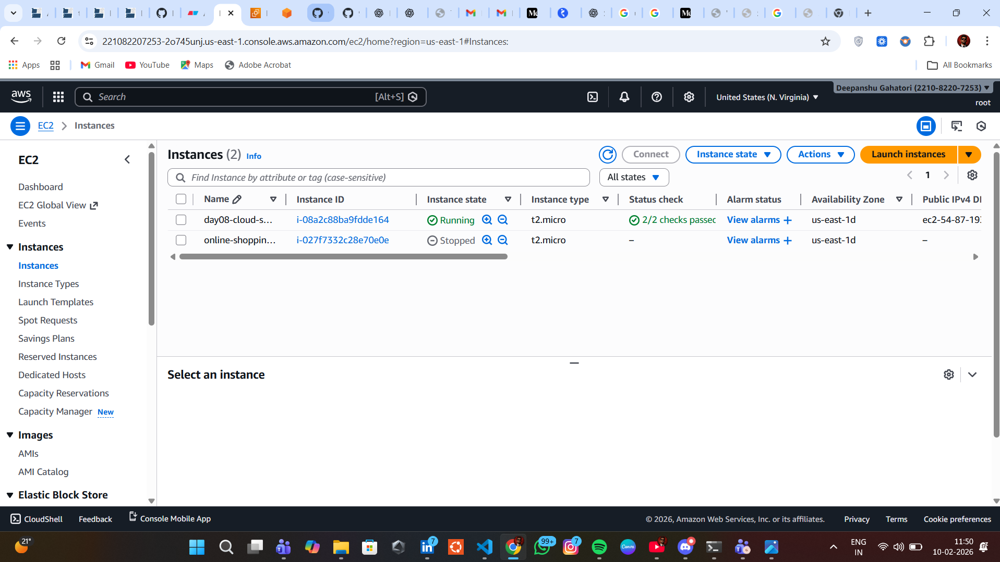
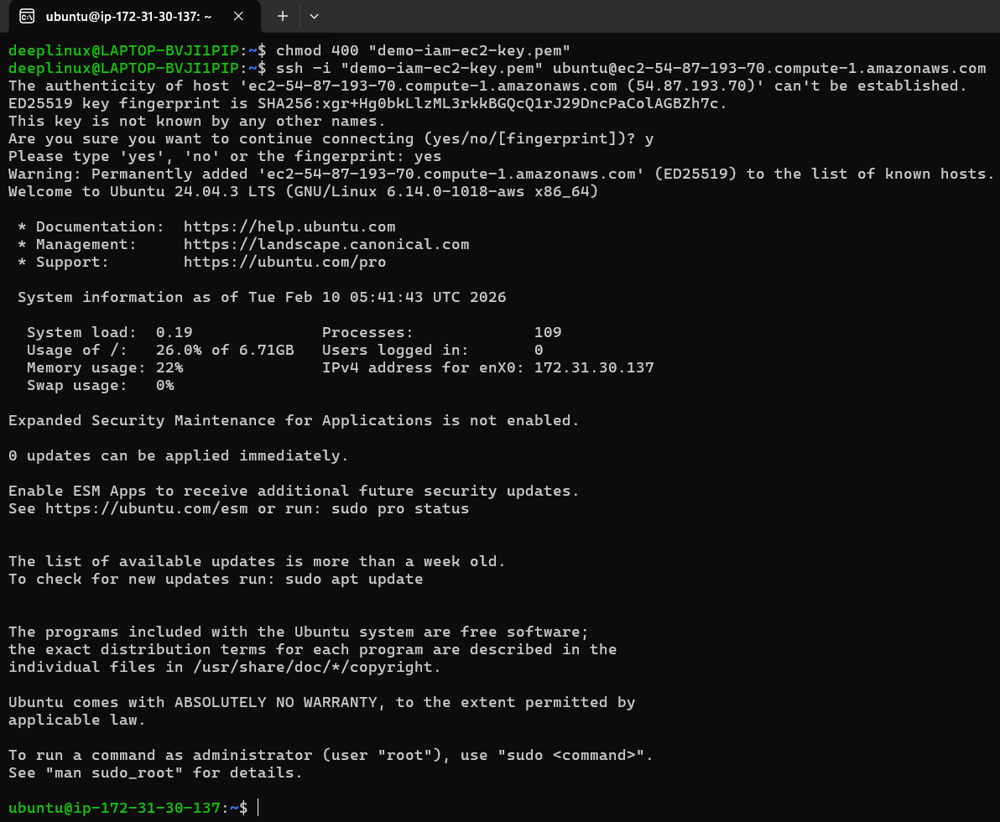
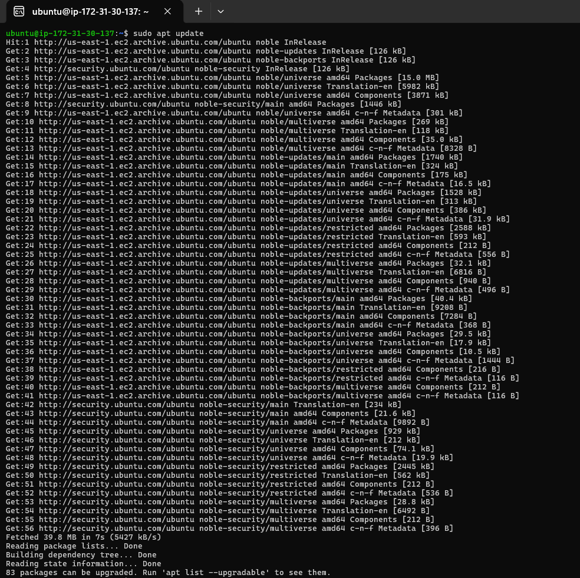
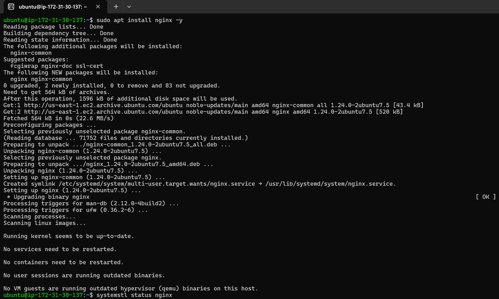
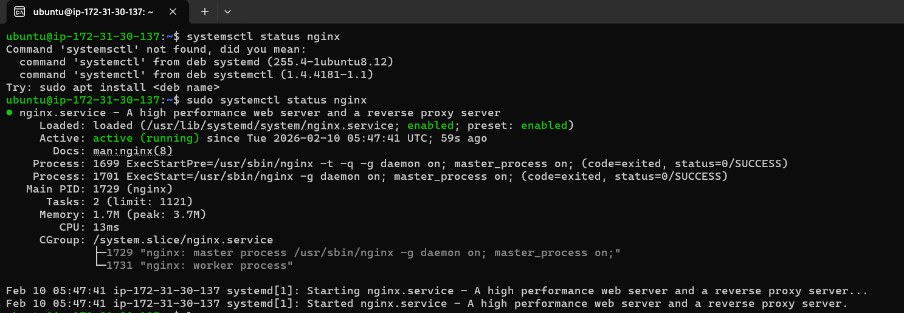
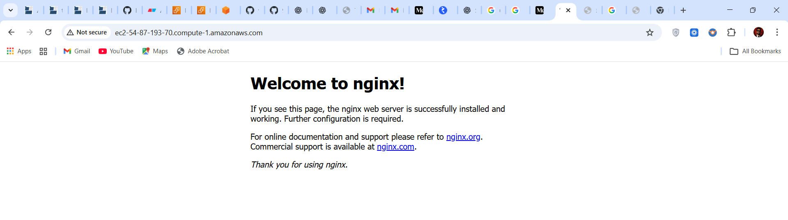
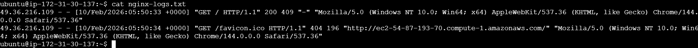
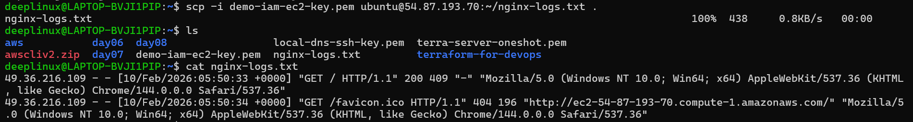

# Day 08 – Cloud Server Setup: Nginx Web Deployment

## Overview
The objective of this task is to deploy a real web server on a cloud virtual machine, expose it securely to the internet, and extract server access logs.  
This simulates basic real-world DevOps server provisioning.


## Prerequisites
- AWS EC2 instance (Ubuntu 22.04 LTS)
- SSH key pair (`.pem`)
- Local Linux terminal
- Basic Linux commands knowledge

---

## Step 1: Launch Cloud Instance

### Instance Configuration
- Operating System: Ubuntu 22.04 LTS
- Instance Type: `t2.micro`
- Authentication: SSH key pair

### Security Group Rules
- **SSH (Port 22)** – Allowed from my IP
- **HTTP (Port 80)** – Allowed from `0.0.0.0/0`

📸 **Screenshot:** EC2 instance running




## Step 2: Connect to Server via SSH

### SSH Command
```bash
chmod 400 demo-iam-ec2-key.pem
ssh -i demo-iam-ec2-key.pem ubuntu@<PUBLIC_IP>
```
Successful SSH login confirms server access.

**📸 Screenshot:** SSH connection established



## Step 3: Update System Packages
```bash
sudo apt update && sudo apt upgrade -y
```

**📸 Screenshot:** System Updated 



## Step 4: Install and Verify Nginx
### Install Nginx
```bash
sudo apt install nginx -y
```

### Verify Nginx Status
```bash
sudo systemctl status nginx
```

### Expected output:
```bash
Service state: active (running)
```
**📸 Screenshot:**




## Step 5: Verify Web Server Accessibility

Confirmed HTTP (port 80) is allowed in the security group

Opened the browser and visited:

```bash
http://<PUBLIC_IP>
```

The Nginx Welcome Page was displayed successfully

**📸 Screenshot:** Nginx welcome page in browser



## Step 6: View and Extract Nginx Logs

### List Nginx Log Files
```bash
sudo ls /var/log/nginx
```

### View Access Logs
```bash
sudo cat /var/log/nginx/access.log
```
### Save Logs to a File
```bash
sudo cat /var/log/nginx/access.log > ~/nginx-logs.txt
```

**📸 Screenshot:** Nginx log output



## Step 7: Download Logs to Local Machine
### Exit EC2 Instance
```bash
exit
```

### Download Logs Using `scp` (Run on Local Machine)
```bash
scp -i demo-iam-ec2-key.pem ubuntu@<PUBLIC_IP>:~/nginx-logs.txt .
```

### Verify File Locally
```bash
cat nginx-logs.txt
```
**📸 Screenshot:**



## Commands Used

* sudo apt update && sudo apt upgrade -y

* sudo apt install nginx -y

* sudo systemctl status nginx

* sudo cat /var/log/nginx/access.log

* scp -i demo-iam-ec2-key.pem ubuntu@<PUBLIC_IP>:~/nginx-logs.txt .

---

## Challenges Faced

1. Attempted to run scp from EC2 instead of local machine

2. Incorrect log file name used initially

3. SSH host authenticity prompt during first connection

## Resolution

1. Corrected SCP execution context

2. Verified file names before transfer

3. Accepted SSH host fingerprint as expected behavior


## What I Learned

1. How to deploy a web server on a cloud VM

2. Importance of security group configuration

3. Location of Nginx access logs

4. Correct usage of SSH and SCP

5. Difference between local and server execution context
