# Day 09 – Linux User & Group Management Challenge

---

## Task 1: Create Users

### Commands Used

```bash
sudo useradd -m tokyo
sudo useradd -m berlin
sudo useradd -m professor

sudo passwd tokyo
sudo passwd berlin
sudo passwd professor
```

### Verification Commands

```bash
grep -E 'tokyo|berlin|professor' /etc/passwd
ls -l /home
```

### Output Screenshots

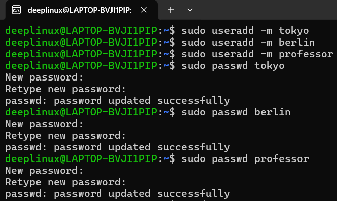
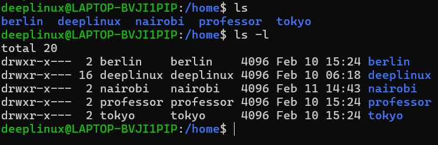
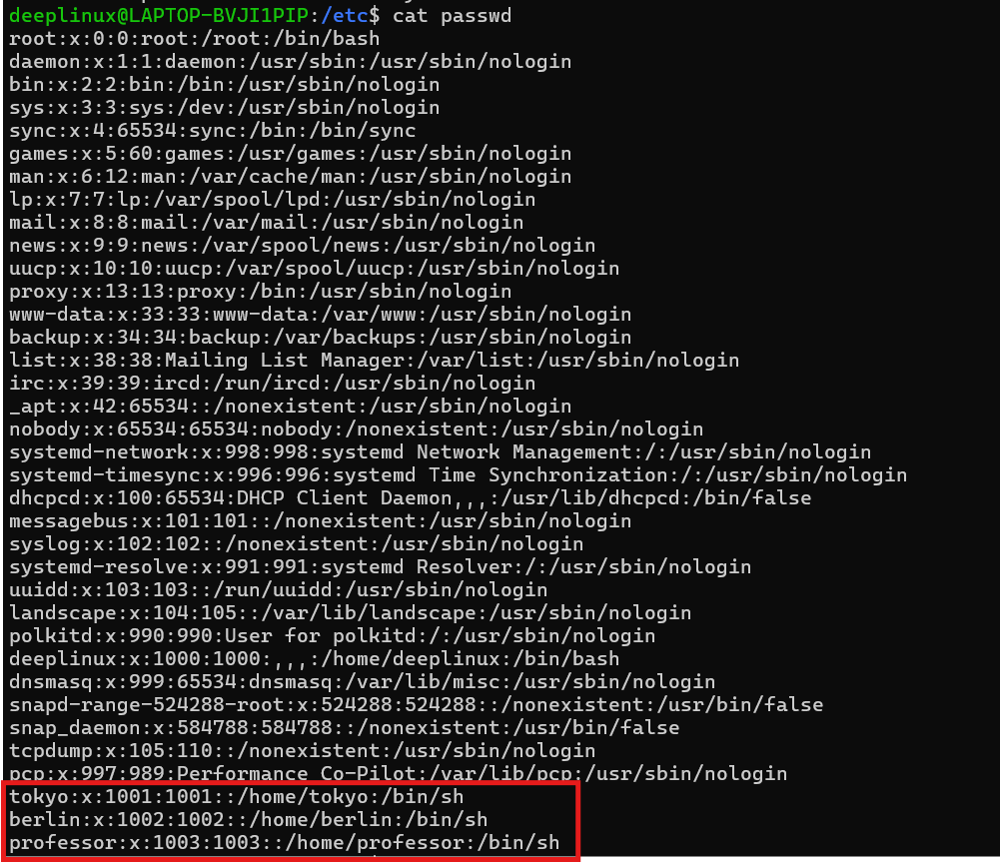
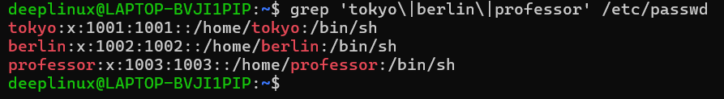

---

## Task 2: Create Groups

### Commands Used

```bash
sudo groupadd developers
sudo groupadd admins
```

### Verification

```bash
grep -E 'developers|admins' /etc/group
```

### Output Screenshots

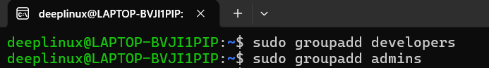
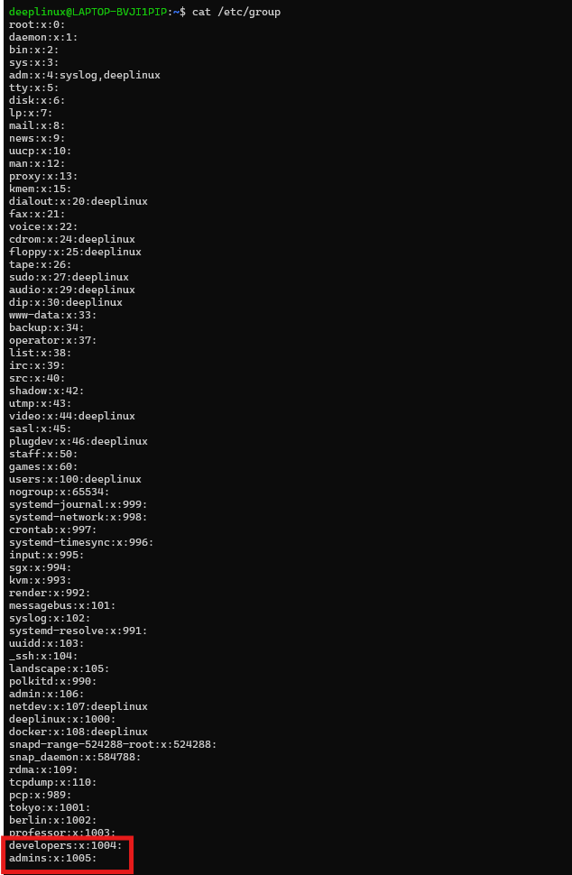
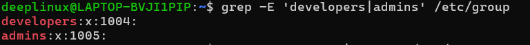

---

## Task 3: Assign Users to Groups

### Commands Used

```bash
sudo usermod -aG developers tokyo
sudo usermod -aG developers,admins berlin
sudo usermod -aG admins professor
```

### Verification

```bash
groups tokyo
groups berlin
groups professor
```

### Output Screenshots

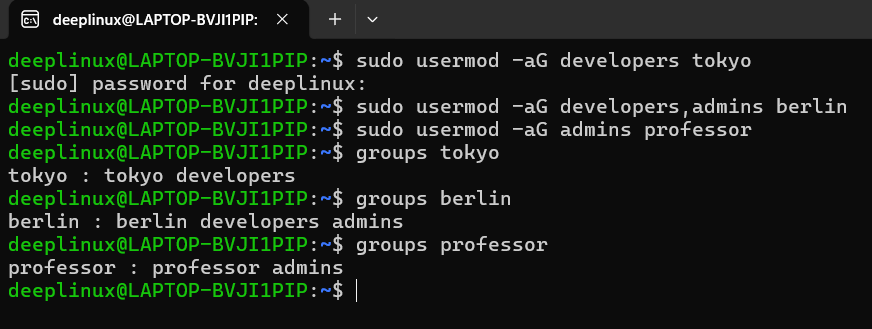

---

## Task 4: Shared Directory Setup

### Commands Used

```bash
sudo mkdir /opt/dev-project
sudo chgrp developers /opt/dev-project
sudo chmod 775 /opt/dev-project
```

### Test File Creation

```bash
sudo -u tokyo touch /opt/dev-project/tokyo.txt
sudo -u berlin touch /opt/dev-project/berlin.txt
ls -l /opt/dev-project
```

### Output Screenshots

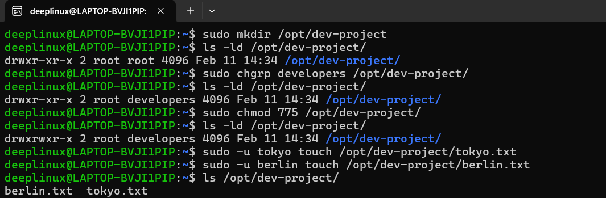

**Trying Error**

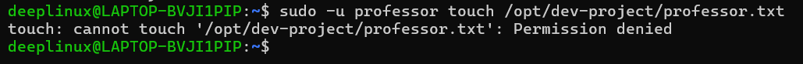

---

## Task 5: Team Workspace

### Commands Used

```bash
sudo useradd -m nairobi
sudo passwd nairobi

sudo groupadd project-team

sudo usermod -aG project-team nairobi
sudo usermod -aG project-team tokyo

sudo mkdir /opt/team-workspace
sudo chgrp project-team /opt/team-workspace
sudo chmod 775 /opt/team-workspace
```

### Test

```bash
sudo -u nairobi touch /opt/team-workspace/nairobi.txt
ls -l /opt/team-workspace
```

### Output Screenshots

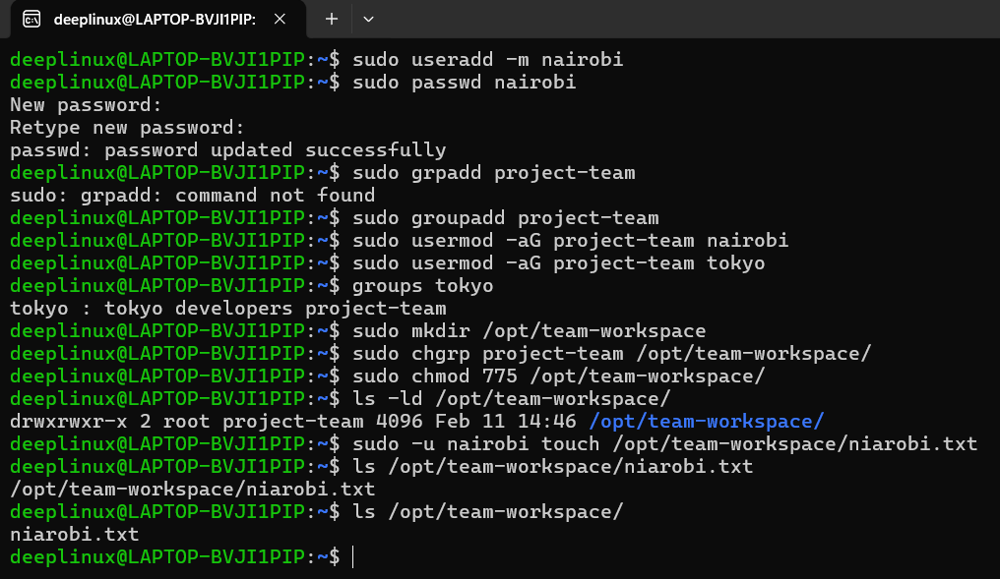

---

## Task 6: Remove User from Group - gpasswd (self-study)

### Remove berlin from admins group

```bash
sudo gpasswd -d berlin admins
```

### Verify

```bash
groups berlin
```

### Output Screenshots

- gpasswd command output
- groups berlin output after removal

---

## Task 7: Delete Group - groupdel (self-study)

### Delete admins group

```bash
sudo groupdel admins
```

### Verify

```bash
grep admins /etc/group
```

(Should return no output)

### Output Screenshots

- groupdel command
- Verification output

---

# Summary

## Users Created
- tokyo
- berlin
- professor
- nairobi

## Groups Created
- developers
- admins (deleted later)
- project-team

## Key Commands Practiced
- useradd -m
- passwd
- groupadd
- usermod -aG
- gpasswd -d
- groupdel
- chgrp
- chmod
- groups
- sudo -u

---

## What I Learned

1. Group ownership controls shared access securely
2. Always use `-aG` with usermod to avoid overwriting groups
3. `gpasswd -d` safely removes users from groups
4. `groupdel` fails if the group is primary for any user
5. Proper 775 permissions are better than 777 in production
