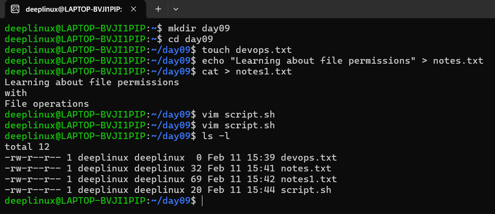
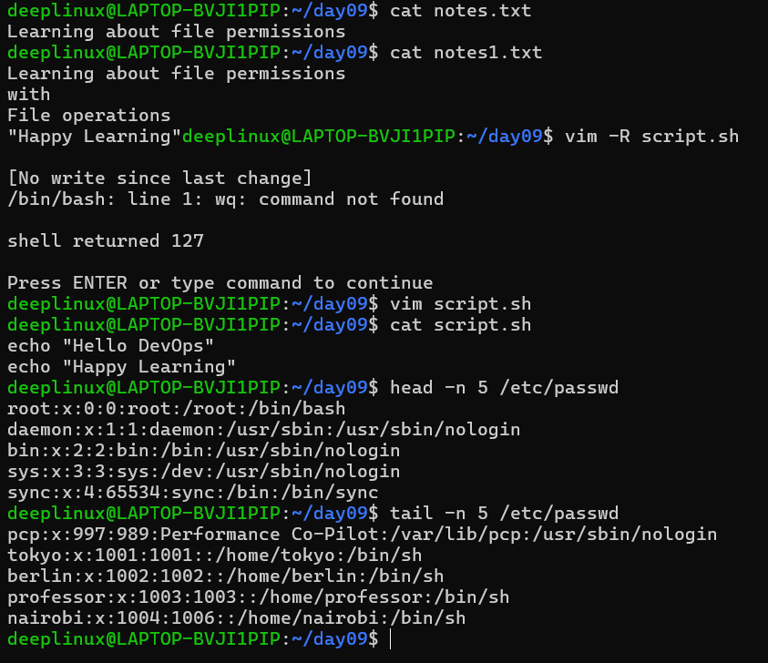
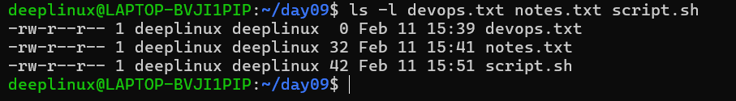
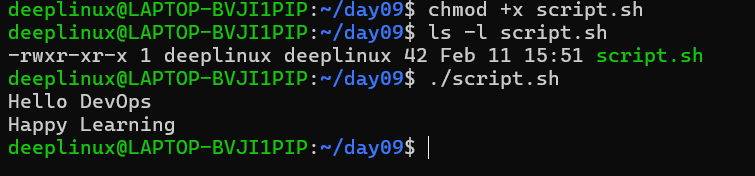
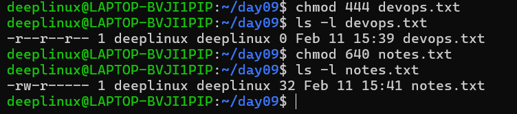
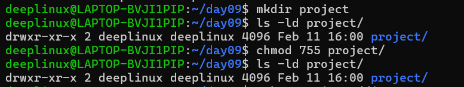
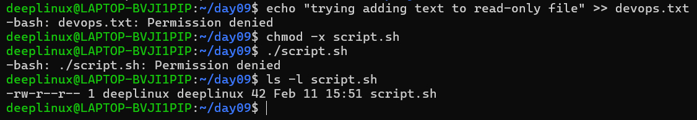

# Day 10 – File Permissions & File Operations Challenge

---

## Task 1: Create Files

### Commands Used

```bash
touch devops.txt
echo "..." > notes.txt
vim script.sh
```

### Output Screenshot



---

## Task 2: Read Files

### Commands Used

```bash
cat notes.txt
vim -R script.sh
head -n 5 /etc/passwd
tail -n 5 /etc/passwd
```

### Output Screenshot



---

## Task 3: Understand Permissions

### Command

```bash
ls -l devops.txt notes.txt script.sh
```

### Output Screenshot



### Explanation

rw-r--r--

Owner: read, write  
Group: read  
Others: read  
No execute permission for anyone  

Numeric value: 644

---

## Task 4: Modify Permissions

### 1️⃣ Make script.sh Executable

**Command:**

```bash
chmod +x script.sh
ls -l script.sh
```

**Output Screenshot:**



### 2️⃣ Make devops.txt Read-Only

**Command:**

```bash
chmod a-w devops.txt
ls -l devops.txt
```

### 3️⃣ Set notes.txt to 640

**Command:**

```bash
chmod 640 notes.txt
ls -l notes.txt
```

**Output Screenshot:**



### 4️⃣ Create project Directory with 755

**Command:**

```bash
mkdir project
chmod 755 project
ls -ld project
```

**Output Screenshot:**



---

## Task 5: Test Permissions

### 1️⃣ Try Writing to Read-Only File

**Command:**

```bash
echo "test" >> devops.txt
```

**Expected Error:**

```bash
devops.txt: Permission denied
```

### 2️⃣ Try Executing File Without Execute Permission

**Remove execute:**

```bash
chmod -x notes.txt
```

**Try to run:**

./notes.txt

**Expected Error:**

```bash
./notes.txt: Permission denied
```

## Error Output Attachment Section

Attach the following screenshots clearly labeled:



---

## Commands Summary

```bash
touch devops.txt
echo "Linux permissions..." > notes.txt
vim script.sh
ls -l
cat notes.txt
vim -R script.sh
head -n 5 /etc/passwd
tail -n 5 /etc/passwd
chmod +x script.sh
chmod a-w devops.txt
chmod 640 notes.txt
mkdir project
chmod 755 project
chmod -x notes.txt
```

---

## What I Learned

1. File permissions directly control execution and security.
2. Execute permission is mandatory to run scripts.
3. Numeric permissions (640, 755) are preferred in automation.
4. Linux follows the principle of least privilege.
5. Incorrect permissions cause real production failures.

---

## Real-World DevOps Insight

- Never use chmod 777 in production.
- CI/CD pipelines fail if scripts lack execute permission.
- Web servers return 403 if directory permissions are wrong.
- SSH keys must have strict permissions (600) to work.
