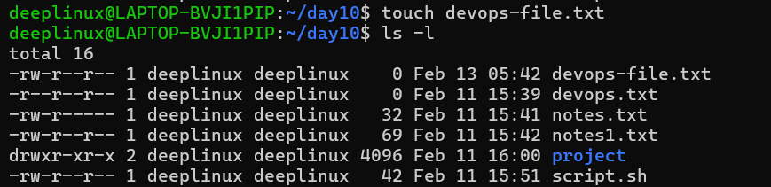
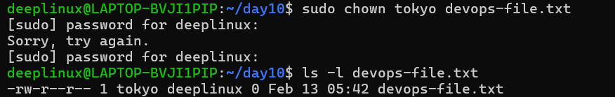
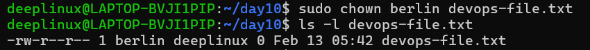
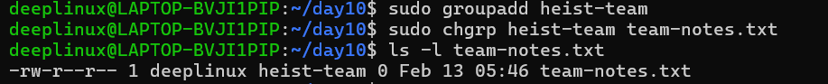
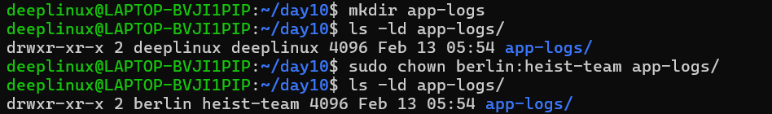
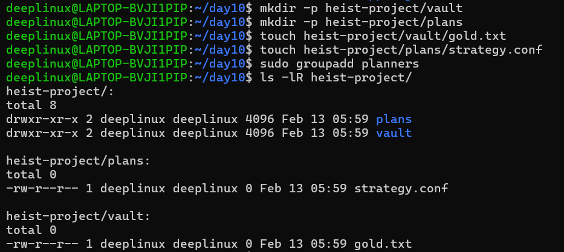
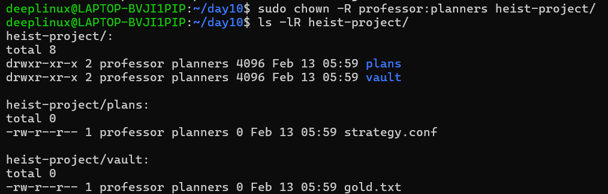
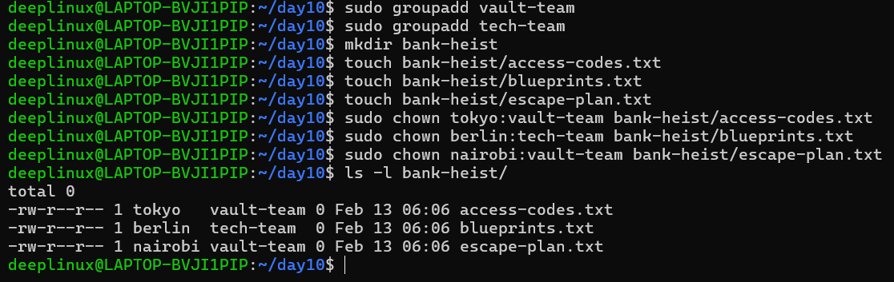

# Day 11 Challenge - File Ownership (chown & chgrp)

## Overview

This challenge focused on mastering Linux file and directory ownership
using: - chown - chgrp - Combined owner & group changes - Recursive
ownership updates

Understanding ownership is critical in real production environments such
as AWS EC2, Docker hosts, CI/CD servers, and web servers.

------------------------------------------------------------------------

## 1️⃣ Files & Directories Created

### Files

-   devops-file.txt
-   team-notes.txt
-   project-config.yaml
-   heist-project/vault/gold.txt
-   heist-project/plans/strategy.conf
-   bank-heist/access-codes.txt
-   bank-heist/blueprints.pdf
-   bank-heist/escape-plan.txt

### Directories

-   app-logs/
-   heist-project/
-   heist-project/vault/
-   heist-project/plans/
-   bank-heist/

### Users Created

-   tokyo
-   berlin
-   nairobi
-   professor

### Groups Created

-   heist-team
-   planners
-   vault-team
-   tech-team

------------------------------------------------------------------------

## 2️⃣ Ownership Changes (Command + Output Screenshots)

### Task 1 -- Understanding File Ownership

#### Command

``` bash
ls -l
```

#### Output Screenshot



------------------------------------------------------------------------

### Task 2 -- Changing File Owner (chown)

#### Change Owner to tokyo

``` bash
sudo chown tokyo devops-file.txt
ls -l devops-file.txt
```

#### Output Screenshot



------------------------------------------------------------------------

#### Change Owner to berlin

``` bash
sudo chown berlin devops-file.txt
ls -l devops-file.txt
```

#### Output Screenshot



------------------------------------------------------------------------

### Task 3 -- Changing Group (chgrp)

#### Create Group

``` bash
sudo groupadd heist-team
```

#### Change File Group

``` bash
sudo chgrp heist-team team-notes.txt
ls -l team-notes.txt
```

#### Output Screenshot



------------------------------------------------------------------------

### Task 4 -- Change Owner & Group Together

#### Change Ownership of project-config.yaml

``` bash
sudo chown professor:heist-team project-config.yaml
ls -l project-config.yaml
```

#### Output Screenshot


------------------------------------------------------------------------

#### Change Ownership of app-logs Directory

``` bash
sudo chown berlin:heist-team app-logs
ls -ld app-logs
```

#### Output Screenshot



------------------------------------------------------------------------

### Task 5 -- Recursive Ownership Change

#### Recursive Command

``` bash
sudo chown -R professor:planners heist-project/
ls -lR heist-project/
```

#### Output Screenshot




------------------------------------------------------------------------

### Task 6 -- Practice Challenge (bank-heist)

#### Set Ownership

``` bash
sudo chown tokyo:vault-team bank-heist/access-codes.txt
sudo chown berlin:tech-team bank-heist/blueprints.pdf
sudo chown nairobi:vault-team bank-heist/escape-plan.txt
```

#### Verification

``` bash
ls -l bank-heist/
```

#### Output Screenshot



------------------------------------------------------------------------

## 3️⃣ Commands Used

### View Ownership

``` bash
ls -l
ls -ld directory_name
ls -lR directory_name
```

### Create Users

``` bash
sudo useradd tokyo
sudo useradd berlin
sudo useradd nairobi
sudo useradd professor
```

### Create Groups

``` bash
sudo groupadd heist-team
sudo groupadd planners
sudo groupadd vault-team
sudo groupadd tech-team
```

### Change Owner

``` bash
sudo chown username filename
```

### Change Group

``` bash
sudo chgrp groupname filename
```

### Change Owner & Group Together

``` bash
sudo chown owner:group filename
```

### Recursive Ownership

``` bash
sudo chown -R owner:group directory/
```

------------------------------------------------------------------------

## 4️⃣ What I Learned

1.  File ownership consists of two components: owner (user) and group.
2.  chown changes the owner, chgrp changes the group, and chown
    owner:group changes both.
3.  Recursive ownership (-R) applies changes to all subdirectories and
    files and must be used carefully in production.

------------------------------------------------------------------------

## 5️⃣ Real-World Importance

Correct file ownership is critical for: - Application deployments on
EC2 - Web server log writing - Docker volume permission handling - CI/CD
pipeline execution - Secure multi-user Linux systems

Incorrect ownership can cause: - Permission denied errors - Application
startup failures - Logging failures - Deployment errors

File ownership management is a core DevOps and Linux administration
skill.
