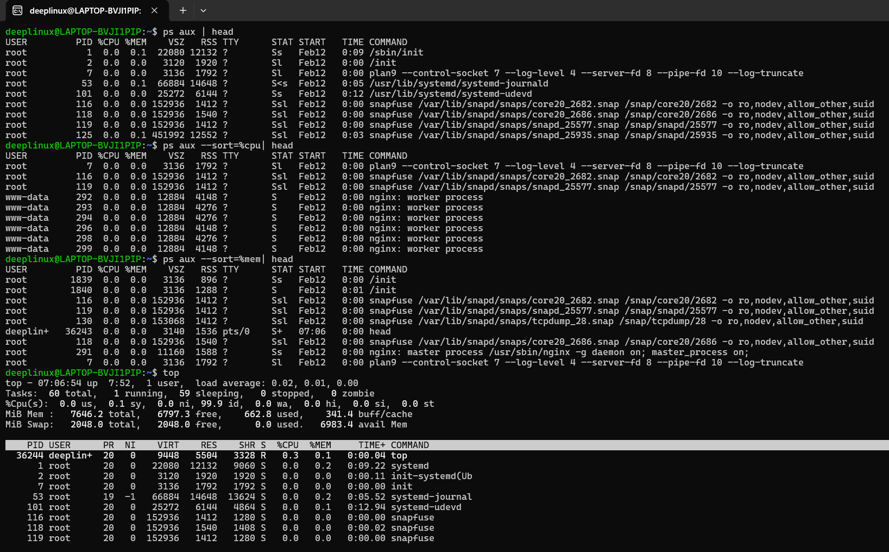
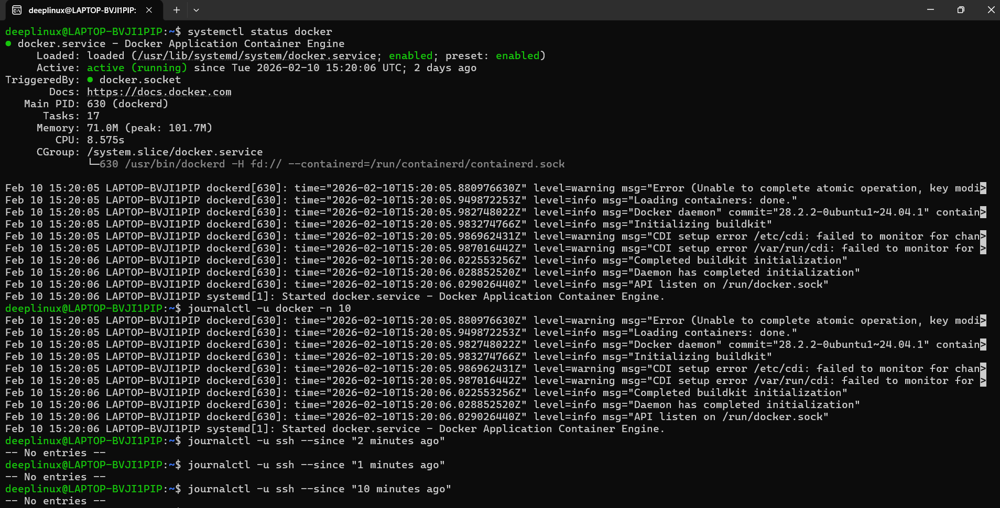
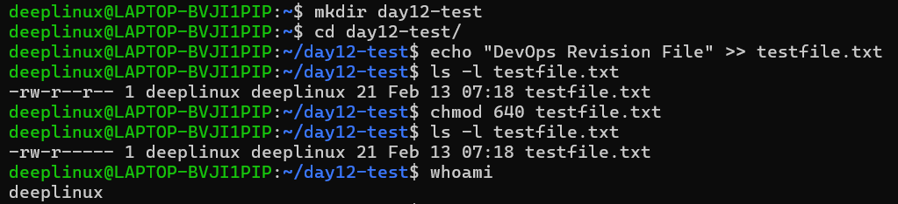
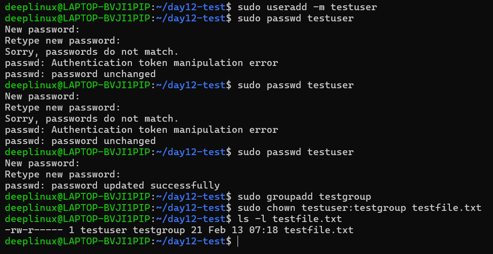

# Day 12 – Breather & Revision

## 🎯 Goal
Take a pause to consolidate Linux fundamentals from Days 01–11 and strengthen operational confidence.

---

# 1️⃣ Mindset & Plan Review (Day 01)

I revisited my original goal of becoming job-ready in AWS, Linux, and DevOps.

### Observations
- Goal still aligned with becoming production-ready.
- Try to give time to theory also with hands-on.
- Must practice debugging mindset more.

### Improvement Plan
- Practice services and logs daily.
- Focus on troubleshooting-based learning.
- Improve confidence in file permissions and ownership.

---

# 2️⃣ Process Monitoring Practice

## Commands Executed

```bash
ps aux | head
ps aux --sort=%cpu | head
ps aux --sort=%mem | head
top
```

## What These Commands Do

- `ps aux` → Lists all running processes.
- `--sort=%cpu` → Sort processes by CPU usage.
- `--sort=%mem` → Sort processes by memory usage.
- `top` → Real-time system resource monitor.

## Observations

- Most processes are owned by `root`.
- `nginx` worker processes running under `www-data`.
- Docker daemon running normally.
- System load average was very low.
- No zombie processes observed.

## Production Insight

When server is slow:

1. Run `top`
2. Run `ps aux --sort=%cpu | head`
3. Identify suspicious high-usage processes

## 📸 Output Screenshot – Process Monitoring



---

# 3️⃣ Service Health Check

## Commands Executed

```bash
systemctl status docker
journalctl -u docker -n 10
journalctl -u ssh --since "10 minutes ago"
```

## What These Commands Do

- `systemctl status <service>` → Shows service state.
- `journalctl -u <service>` → Displays service logs.
- `-n 10` → Last 10 log entries.
- `--since` → Filter logs by time.

## Observations

- Docker service was `active (running)`.
- Service is enabled to start at boot.
- Logs show successful initialization.
- SSH had no recent log activity.

## How To Check Service Health (Production Approach)

```bash
systemctl status <service>
journalctl -u <service> -n 50
ps aux | grep <service>
```

Logs are always the source of truth.

## 📸 Output Screenshot – Service Check



---

# 4️⃣ File & Permission Practice

## Commands Executed

```bash
mkdir day12-test
cd day12-test
echo "DevOps Revision File" >> testfile.txt
ls -l testfile.txt
chmod 640 testfile.txt
whoami
```

## Initial Permission

```
-rw-r--r--
```

## After chmod 640

```
-rw-r-----
```

## Permission Breakdown

| Number | Meaning |
|--------|----------|
| 6 | Read + Write (Owner) |
| 4 | Read Only (Group) |
| 0 | No Access (Others) |

### Permission Structure

```
-rw-r-----
│ │  │  │
│ │  │  └── Others
│ │  └───── Group
│ └──────── Owner
└────────── File Type
```

## Important Security Note

Never use:

```bash
chmod 777 file
```

This gives full access to everyone and is insecure in production.

## 📸 Output Screenshot – File Permission



---

# 5️⃣ User & Ownership Practice

## Commands Executed

```bash
sudo useradd -m testuser
sudo passwd testuser
sudo groupadd testgroup
sudo chown testuser:testgroup testfile.txt
ls -l testfile.txt
id testuser
```

## Observations

- User created successfully.
- Password set successfully.
- Group created successfully.
- File ownership changed from `deeplinux` to `testuser`.
- Group ownership changed to `testgroup`.

New ownership format:

```
-rw-r----- 1 testuser testgroup
```

## Why This Matters in Production

Ownership issues commonly break:

- Web servers
- Docker volumes
- CI/CD pipelines
- Shared directories

First debugging step:

```bash
ls -l
```

Then fix using:

```bash
sudo chown user:group file
```

## 📸 Output Screenshot – User & Ownership



---

# 6️⃣ Mini Self-Check

## 1️⃣ Which 3 commands save you the most time?

- `systemctl status`
- `journalctl -u`
- `ps aux --sort=%cpu`

These immediately show service state and system health.

---

## 2️⃣ How do you check if a service is healthy?

```bash
systemctl status <service>
journalctl -u <service> -n 20
ps aux | grep <service>
```

---

## 3️⃣ How do you safely change ownership & permissions?

```bash
sudo chown user:group file.txt
chmod 640 file.txt
```

Always check first:

```bash
ls -l
```

---

## 4️⃣ Focus for Next 3 Days

- Linux networking basics
- Deeper systemd understanding
- More troubleshooting simulations

---

# 🔑 Key Takeaways

- Logs are more important than guessing.
- Permissions and ownership directly affect applications.
- CPU and memory sorting is critical for debugging.
- Secure defaults matter in production.

---

# ✅ Conclusion

Day 12 reinforced:

- Process monitoring
- Service health validation
- Log analysis
- File permissions
- User and ownership management

Confidence improved in:

- `systemctl`
- `journalctl`
- `chmod` numeric system
- `chown`
- Process investigation commands

This revision strengthened operational thinking and production awareness.
