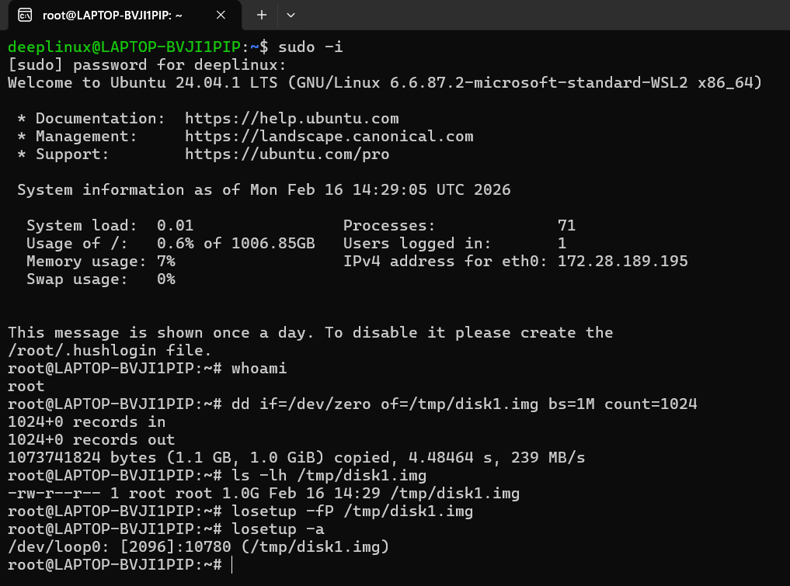
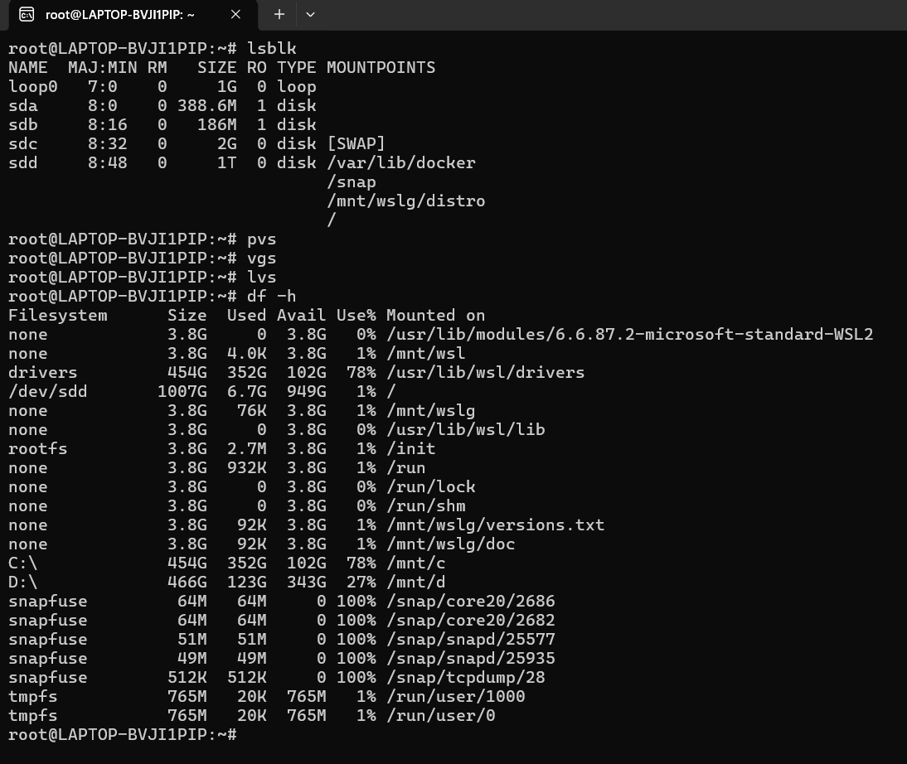
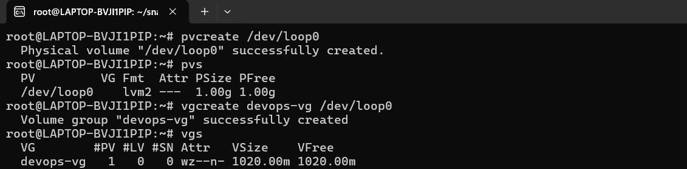
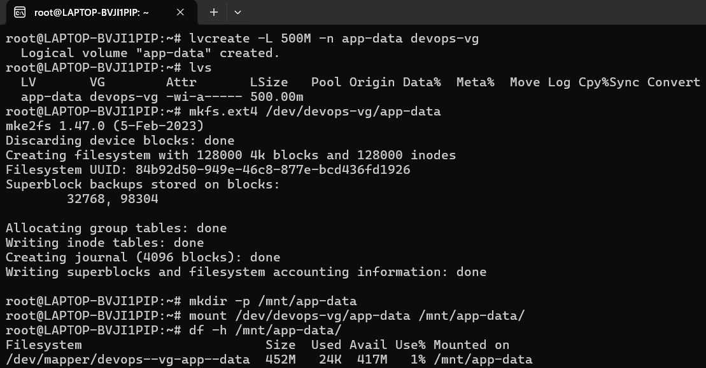
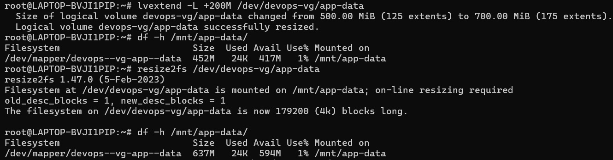
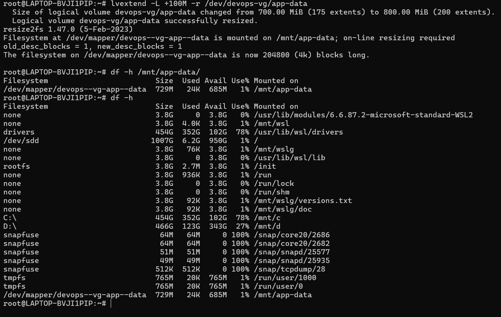

# Day 13 – Linux Volume Management (LVM)

## Introduction

LVM (Logical Volume Management) Linux me flexible storage management ke liye use hota hai.  
Isse hum physical disk ko directly partition karne ke bajay abstract layer create karte hain jise baad me resize kiya ja sakta hai without re-partitioning.

LVM Structure:

Physical Disk → Physical Volume (PV) → Volume Group (VG) → Logical Volume (LV)

### Before Starting

1. Switch to root user
2. No spare disk?Create virtual one

### Output Screenshot



---

# Task 1: Check Current Storage

## Purpose

System me currently kaun-kaun se disks, partitions, aur LVM structures exist karte hain wo check karna.  
Storage change karne se pehle current state dekhna best practice hai.

## Commands

```
lsblk
pvs
vgs
lvs
df -h

```

## Command Explanation

- `lsblk` → System ke saare block devices (disk/partition) dikhata hai  
- `pvs` → Existing Physical Volumes dikhata hai  
- `vgs` → Existing Volume Groups dikhata hai  
- `lvs` → Existing Logical Volumes dikhata hai  
- `df -h` → Mounted filesystems aur unka usage human readable format me dikhata hai  

---

## Output Screenshot


---

# Task 2: Create Physical Volume

## Purpose

Raw disk ko LVM ke control me dena.  
Iske baad disk directly use nahi hota, balki LVM manage karta hai.

## Commands

```
pvcreate /dev/loop0
pvs
```

## Command Explanation

- `pvcreate /dev/loop0`  
  Disk ko initialize karta hai as LVM Physical Volume.

- `pvs`  
  Verify karta hai ki PV successfully create hua ya nahi.

---

# Task 3: Create Volume Group

## Purpose

Physical Volume ko ek storage pool me convert karna.  
Volume Group future logical volumes ke liye storage container hota hai.

## Commands

```
vgcreate devops-vg /dev/loop0
vgs
```

## Command Explanation

- `vgcreate devops-vg /dev/loop0`  
  `/dev/loop0` ko use karke `devops-vg` naam ka volume group create karta hai.

- `vgs`  
  Volume groups ka status aur size check karta hai.

---

## Output Screenshot



---

# Task 4: Create Logical Volume

## Purpose

Volume Group ke andar usable logical partition banana jise hum filesystem bana ke mount kar sakein.

## Commands

```
lvcreate -L 500M -n app-data devops-vg
lvs
```

## Command Explanation

- `-L 500M` → Logical volume size define karta hai  
- `-n app-data` → Logical volume ka naam  
- `devops-vg` → Volume group jisme create hoga  

- `lvs` → Logical volumes list karta hai

Resulting device path:
```
/dev/devops-vg/app-data
```

---

# Task 5: Format and Mount Logical Volume

## Purpose

Logical Volume ko usable filesystem me convert karna aur system me mount karna.

## Commands

```
mkfs.ext4 /dev/devops-vg/app-data
mkdir -p /mnt/app-data
mount /dev/devops-vg/app-data /mnt/app-data
df -h /mnt/app-data
```

## Command Explanation

- `mkfs.ext4` → LV par ext4 filesystem create karta hai  
- `mkdir -p` → Mount point directory create karta hai  
- `mount` → LV ko directory par attach karta hai  
- `df -h` → Verify karta hai ki mount successful hai aur size correct show ho raha hai  

---

## Output Screenshot



---

# Task 6: Extend Logical Volume

## Purpose

Logical volume ka size increase karna without deleting ya recreating it.

## Commands

```
lvextend -L +200M /dev/devops-vg/app-data
resize2fs /dev/devops-vg/app-data
df -h /mnt/app-data
```

## Command Explanation

- `lvextend -L +200M`  
  Existing LV me 200MB additional space add karta hai.

- `resize2fs`  
  Filesystem ko nayi size ke according expand karta hai.  
  Agar ye command nahi chalate, toh filesystem purani size hi use karega.

- `df -h`  
  Verify karta hai ki size successfully increase hua hai.

---

## Output Screenshot




---

# What I Learned

1. LVM allows flexible storage management without repartitioning disks.
2. Logical Volumes can be extended dynamically when storage demand increases.
3. Extending LV alone is not enough; filesystem resize is mandatory.
4. LVM is commonly used in production environments like AWS EC2 with EBS volumes.
5. Proper order (LV → VG → PV removal) is important during cleanup.

---

# Final LVM Flow Summary

Disk → PV → VG → LV → Filesystem → Mount

This abstraction provides flexibility and better storage management compared to traditional partitioning.
