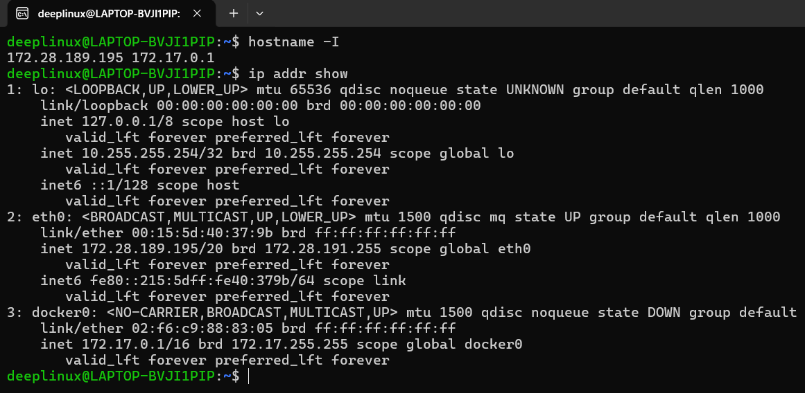
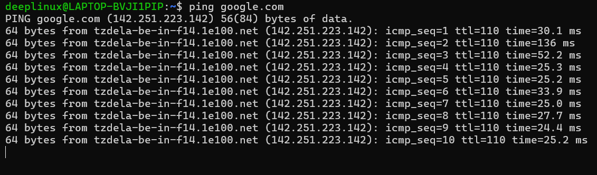
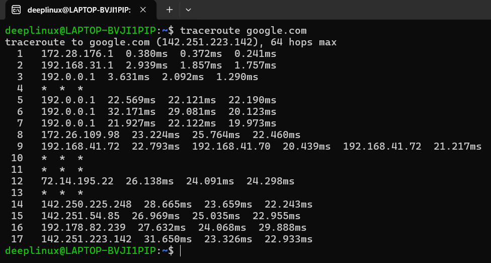
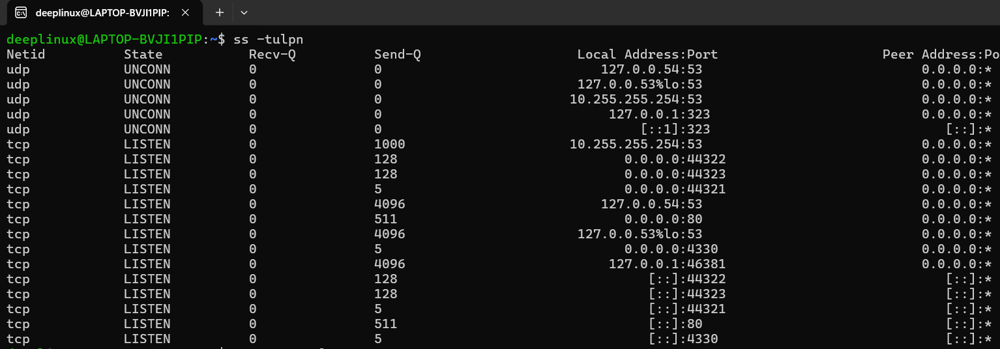
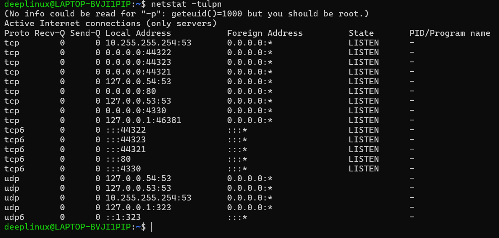
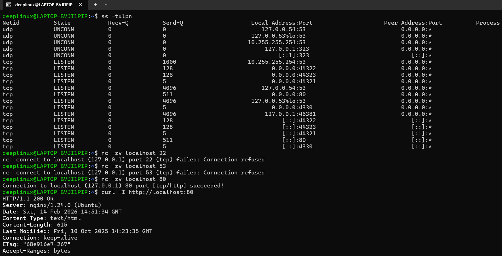
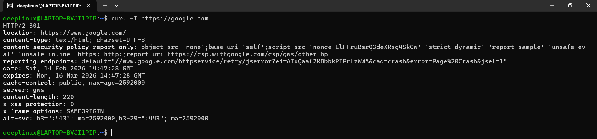
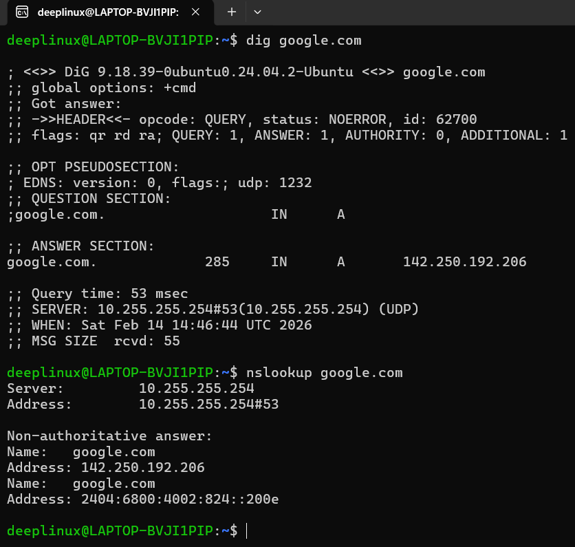

# Day 14 – Networking Fundamentals & Hands-on Checks

## Objective
Practice real-world networking troubleshooting using Linux tools and understand layer-based debugging.

Target tested:
- Remote host: google.com
- Local service: nginx (port 80)

---

# 1. Networking Models

## OSI Model

- L1 Physical → Cables, NIC
- L2 Data Link → MAC, Switching
- L3 Network → IP, Routing
- L4 Transport → TCP/UDP
- L7 Application → HTTP, DNS, SSH

Used for structured troubleshooting.

---

## TCP/IP Model

- Link
- Internet (IP)
- Transport (TCP/UDP)
- Application

---

## Protocol Placement

- IP → Internet layer
- TCP/UDP → Transport layer
- DNS → Application layer (UDP 53)
- HTTP/HTTPS → Application layer (TCP 80/443)

---

## Real Flow Example

curl https://google.com

Application (HTTPS)
→ TCP 443
→ IP
→ Link

---

# 2. Identity & Interface Check (Layer 3)

```bash
hostname -I
ip addr show
```

Observed:
- 172.28.189.195 → Primary interface (eth0)
- 172.17.0.1 → Docker bridge
- Private IP ranges

Conclusion:
System has active network interface and Docker network present.



---

# 3. Reachability Test (Layer 3)

```bash
ping google.com
```

Observed:
- TTL: 110
- Latency: ~25–30 ms
- No packet loss

Conclusion:
Internet reachable.
Ping tests ICMP only, not TCP services.



---

# 4. Routing Path Analysis (Layer 3)

```bash
traceroute google.com
```

Observed:
- Private internal hops
- ISP hops
- Some * entries (ICMP blocked routers)
- Final destination reached

Conclusion:
Routing normal.



---

# 5. Listening Services (Layer 4)

```bash
ss -tulpn
netstat -tulpn
```

Observed:
- TCP 80 → LISTEN
- TCP 53 → LISTEN
- TCP 22 → Not listening
- Multiple high ports (44321, 44322, 44323)

Conclusion:
- Nginx running
- SSH service not running




---

# 6. Port Probing (Layer 4)

## SSH Check

```bash
nc -zv localhost 22
```

Result:
Connection refused

Meaning:
- Host reachable
- No process listening
- Not firewall issue

---

## DNS TCP Check

```bash
nc -zv localhost 53
```

Result:
Connection refused

Reason:
DNS primarily uses UDP.

---

## HTTP Check

```bash
nc -zv localhost 80
```

Result:
Connection succeeded

Meaning:
TCP handshake successful.



---

# 7. HTTP Application Verification (Layer 7)

```bash
curl -I http://localhost:80
```

Output:
HTTP/1.1 200 OK  
Server: nginx/1.24.0  

Conclusion:
Application healthy.

---

## Remote HTTPS Check

```bash
curl -I https://google.com
```

Output:
HTTP/2 301  
Redirect to https://www.google.com/

Conclusion:
- DNS working
- TCP 443 working
- TLS handshake successful
- Application responding



---

# 8. DNS Resolution (Layer 7)

```bash
dig google.com
nslookup google.com
```

Resolved:
142.250.192.206

DNS Server:
10.255.255.254

Conclusion:
DNS working properly.



---

# 9. Connection Snapshot

```bash
netstat -an | head
```

Observed:
Multiple LISTEN states.
System active and services bound.

Note:
Use sudo ss -tulpn for full process details.

---

# 10. Critical Concepts Learned

Connection refused → Service not running  
Timeout → Firewall / Security group / Network issue  

0.0.0.0 → Accessible externally  
127.0.0.1 → Local only  

Ping success ≠ Web service working  

Curl is strongest quick diagnostic command.

---

# 11. Structured Troubleshooting Flow

Website down:

1. curl -I https://site
2. dig site
3. nc -zv site 443
4. Check firewall/security group
5. Check app logs

SSH not working:

1. ss -tulpn | grep 22
2. systemctl status ssh
3. nc -zv server 22
4. Check firewall/security group

HTTP 500:

Application layer issue.
Check logs.

---

# Summary

Validated:

- IP configuration
- Reachability
- Routing
- Listening services
- Port connectivity
- DNS resolution
- HTTP application health

Applied structured, layer-based debugging instead of random command execution.

