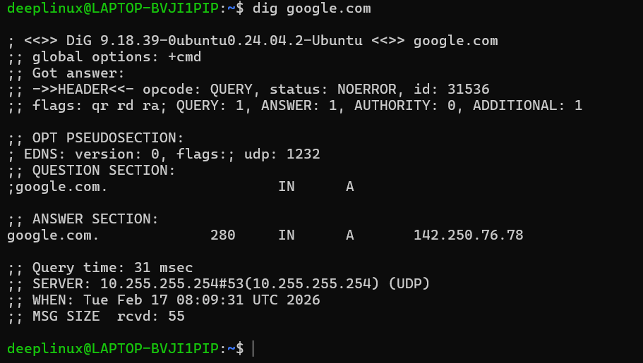
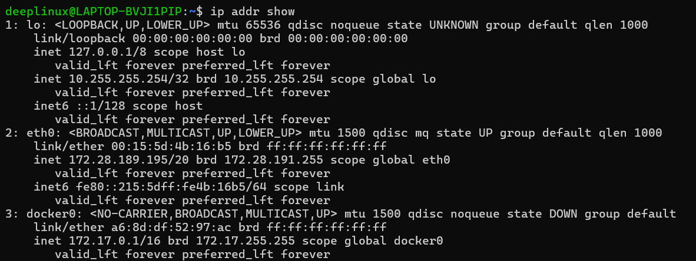
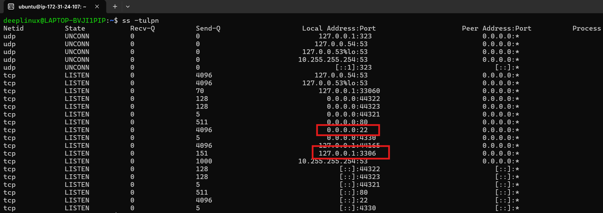

# Day 15 – Networking Concepts: DNS, IP, Subnets & Ports

---

# Task 1 – DNS: How Names Become IPs

## What happens when you type google.com in a browser?

1. The browser checks its local DNS cache.
2. If not found, it queries a configured DNS resolver.
3. The resolver contacts authoritative DNS servers to get the IP address.
4. The browser connects to that IP over HTTP/HTTPS.

DNS translates human-readable names into IP addresses.

---

## DNS Record Types

- **A** – Maps a domain to an IPv4 address  
- **AAAA** – Maps a domain to an IPv6 address  
- **CNAME** – Alias pointing one domain to another  
- **MX** – Defines mail servers for the domain  
- **NS** – Specifies authoritative name servers  

---

## dig google.com

```bash
dig google.com
```

### Expected Output (trimmed)

```bash
; <<>> DiG 9.18.1 <<>> google.com
;; ANSWER SECTION:
google.com.     300     IN      A       142.250.183.206
```

- A Record: 142.250.183.206  
- TTL: 300 seconds  


### Screenshot:



---

# Task 2 – IP Addressing

## What is an IPv4 Address?

An IPv4 address is a 32-bit number divided into four octets (8 bits each).

Example:
192.168.1.10

Each octet ranges from 0–255.

---

## Public vs Private IP

- Public IP – Accessible over the internet (Example: 8.8.8.8)  
- Private IP – Used inside private networks (Example: 192.168.1.25)  

Private IPs require NAT for internet access.

---

## Private IP Ranges

- 10.0.0.0 – 10.255.255.255  
- 172.16.0.0 – 172.31.255.255  
- 192.168.0.0 – 192.168.255.255  

---

## ip addr show

```bash
ip addr show
```

### Expected Output (trimmed)

```bash
2: eth0: <BROADCAST,MULTICAST,UP,LOWER_UP>
    inet 192.168.1.25/24 brd 192.168.1.255 scope global dynamic eth0
1: lo:
    inet 127.0.0.1/8 scope host lo
```

- 192.168.1.25 → Private IP  
- 127.0.0.1 → Loopback  

### Screenshot:



---

# Task 3 – CIDR & Subnetting

## What does /24 mean?

In 192.168.1.0/24:

- 24 bits represent the network portion.
- 8 bits represent the host portion.
- Subnet mask: 255.255.255.0

---

## Usable Hosts

Formula:

2^(32 - CIDR) - 2

- /24 → 254 usable hosts  
- /16 → 65,534 usable hosts  
- /28 → 14 usable hosts  

---

## Why Do We Subnet?

- To divide large networks into smaller segments  
- To isolate services (security)  
- To reduce broadcast traffic  
- To design structured cloud networks (VPC subnets)

---

## CIDR Table

| CIDR | Subnet Mask       | Total IPs | Usable Hosts |
|------|-------------------|-----------|--------------|
| /24  | 255.255.255.0     | 256       | 254          |
| /16  | 255.255.0.0       | 65,536    | 65,534       |
| /28  | 255.255.255.240   | 16        | 14           |

---

# Task 4 – Ports: The Doors to Services

## What is a Port?

A port is a logical communication endpoint on a machine.

IP identifies the host.  
Port identifies the service running on that host.

---

## Common Ports

| Port | Service |
|------|---------|
| 22   | SSH |
| 80   | HTTP |
| 443  | HTTPS |
| 53   | DNS |
| 3306 | MySQL |
| 6379 | Redis |
| 27017 | MongoDB |

---

## ss -tulpn

```bash
ss -tulpn
```

### Expected Output (trimmed)

```bash
Netid  State   Recv-Q  Send-Q   Local Address:Port   Peer Address:Port  Process
tcp    LISTEN  0       128      0.0.0.0:22            0.0.0.0:*          users:(("sshd",pid=721,fd=3))
tcp    LISTEN  0       128      0.0.0.0:3306          0.0.0.0:*          users:(("mysqld",pid=950,fd=21))
```

- Port 22 → SSH is listening  
- Port 3306 → MySQL is listening

### Screenshot:



---

# Task 5 – Putting It Together

## curl http://myapp.com:8080 – What Concepts Are Involved?

1. DNS resolves myapp.com to an IP address.
2. TCP connection is established to port 8080.
3. Firewall/Security rules allow or block traffic.
4. Application must be listening on that port.


## App Cannot Reach Database at 10.0.1.50:3306 – What To Check?

1. Network connectivity and routing.
2. Security Group / firewall allowing port 3306.
3. MySQL listening on correct interface (0.0.0.0).
4. Database bind-address configuration.

---

# What I Learned

1. DNS converts domain names into IP addresses and is essential for connectivity.
2. CIDR determines network size and subnetting improves scalability and security.
3. Ports allow multiple services on one server and must be controlled with firewalls.
