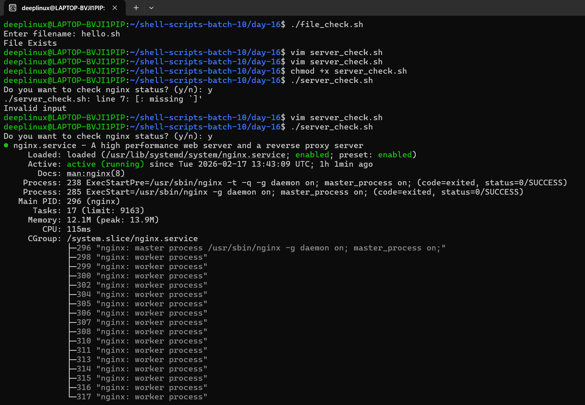
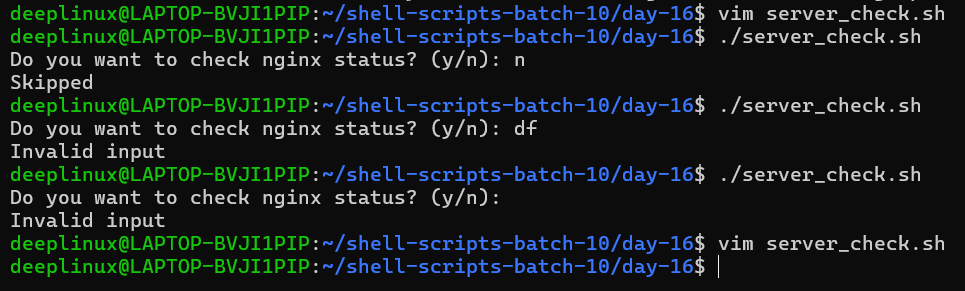

# Day 16 – Shell Scripting Basics

## Objective
Learn the fundamentals of shell scripting:
- Shebang (`#!/bin/bash`)
- Variables
- User input with `read`
- If-else conditions
- File checks
- Exit codes

---

# Task 1 – hello.sh

## Script Code

```bash
#!/bin/bash

echo "Hello, DevOps!"
```

## Commands Used

```bash
chmod +x hello.sh
./hello.sh
```

## Output

```
Hello, DevOps!
```

## Learning

If the shebang line is removed:
- Script runs with default system shell.
- Bash-specific features may break.
- Not safe for production.

Always define interpreter explicitly.

---

# Task 2 – variables.sh

## Script Code

```bash
#!/bin/bash

NAME="Deepanshu"
ROLE="DevOps Engineer"

echo "Hello, I am $NAME and I am a $ROLE"
```

## Run

```bash
chmod +x variables.sh
./variables.sh
```

## Output

```
Hello, I am Deepanshu and I am a DevOps Engineer
```

## Single vs Double Quotes

```bash
echo "Hello $NAME"
```

Output:
```
Hello Shubham
```

```bash
echo 'Hello $NAME'
```

Output:
```
Hello $NAME
```

Double quotes expand variables.  
Single quotes treat text literally.

---

# Task 3 – greet.sh

## Script Code

```bash
#!/bin/bash

read -p "Enter your name: " NAME
read -p "Enter your favourite tool: " TOOL

echo "Hello $NAME, your favourite tool is $TOOL"
```

## Run

```bash
chmod +x greet.sh
./greet.sh
```

## Example Output

```
Enter your name: Deepanshu Gahatori
Enter your favourite tool: Terraform
Hello Deepanshu Gahatori, your favourite tool is Terraform
```

---

# Task 4 – check_number.sh

## Script Code

```bash
#!/bin/bash

read -p "Enter a number: " NUM

if [ "$NUM" -gt 0 ]; then
    echo "The number is positive."
elif [ "$NUM" -lt 0 ]; then
    echo "The number is negative."
else
    echo "The number is zero."
fi
```

## Example Output

```
Enter a number: -5
The number is negative.
```

---

# Task 4 – file_check.sh

## Script Code

```bash
#!/bin/bash

read -p "Enter filename: " FILE

if [ -f "$FILE" ]; then
    echo "File exists."
else
    echo "File does not exist."
fi
```

## Example Output

```
Enter filename: hello.sh
File exists.
```

---

# Task 5 – server_check.sh

## Script Code

```bash
#!/bin/bash

SERVICE="nginx"

read -p "Do you want to check the status of $SERVICE? (y/n): " ANSWER

if [ "$ANSWER" = "y" ]; then
    systemctl status $SERVICE
elif [ "$ANSWER" = "n" ]; then
    echo "Skipped."
else
    echo "Invalid input."
fi
```

## Example Output (Running)

```
Do you want to check the status of nginx? (y/n): y
nginx is running.
```

## Example Output (Not Running)

```
Do you want to check the status of nginx? (y/n): y
nginx is NOT running.
```

---

# Screenshot Placeholders

Added screenshots below:




---

# What I Learned (3 Key Points)

## 1. Shebang Controls Execution Environment
`#!/bin/bash` ensures consistent interpreter usage across systems.

## 2. Always Quote Variables
Use `"$VAR"` to prevent word splitting and unexpected bugs.

## 3. Exit Codes Matter
- `0` = Success
- Non-zero = Failure  
Always check exit codes in automation scripts.

