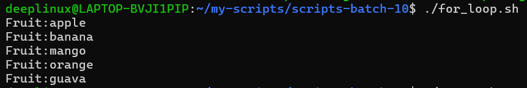
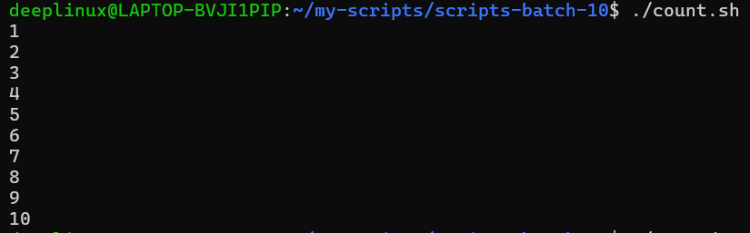
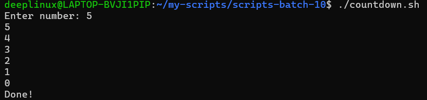
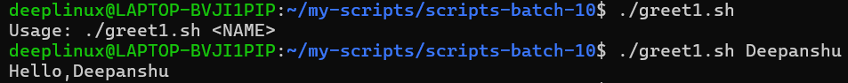
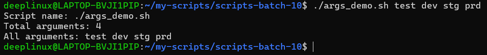
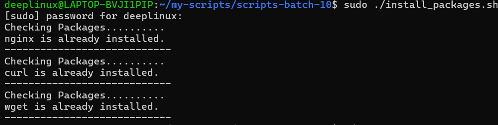

# Day 17 – Shell Scripting: Loops, Arguments & Error Handling

## Overview

Today I practiced writing production-style Bash scripts using:

- For loops
- While loops
- Command-line arguments
- Package installation automation
- Basic error handling

This is core DevOps automation skill.

---

# Task 1 – For Loop

## 1️⃣ for_loop.sh

```bash
#!/bin/bash

fruits="apple banana mango orange guava"

for fruit in $fruits
do
  echo "Fruit: $fruit"
done
```

### ▶ Output



## 2️⃣ count.sh

```bash
#!/bin/bash

for i in {1..10}
do
  echo $i
done
```

### ▶ Output



---

# Task 2 – While Loop

## countdown.sh

```bash
#!/bin/bash

read -p "Enter a number: " num

while [ $num -ge 0 ]
do
  echo $num
  num=$((num - 1))
done

echo "Done!"
```

### ▶ Output



---

# Task 3 – Command-Line Arguments

## 1️⃣ greet.sh

```bash
#!/bin/bash

if [ -z "$1" ]; then
  echo "Usage: ./greet.sh <name>"
  exit 1
fi

echo "Hello, $1!"
```

### ▶ Output




## 2️⃣ args_demo.sh

```bash
#!/bin/bash

echo "Script name: $0"
echo "Total arguments: $#"
echo "All arguments: $@"
```

### ▶ Output



---

# Task 4 – Install Packages via Script

## install_packages.sh

```bash
#!/bin/bash

# Check if script is run as root
if [ "$EUID" -ne 0 ]; then
  echo "Please run this script as root"
  exit 1
fi

packages=("nginx" "curl" "wget")

for pkg in "${packages[@]}"
do
  echo "Checking $pkg..."

  if dpkg -s "$pkg" &> /dev/null; then
    echo "$pkg is already installed."
  else
    echo "$pkg not found. Installing..."
    apt-get update
    apt-get install -y "$pkg"
  fi

  echo "-----------------------------"
done
```

### ▶ Output (Example)



---

# Task 5 – Error Handling

## safe_script.sh

```bash
#!/bin/bash

set -e

mkdir /tmp/devops-test || echo "Directory already exists"

cd /tmp/devops-test || {
  echo "Failed to enter directory"
  exit 1
}

touch testfile.txt || {
  echo "Failed to create file"
  exit 1
}

echo "Script completed successfully."
```

### ▶ Output


---

# Key Learnings

1. Loops automate repetitive tasks.
2. Command-line arguments make scripts reusable.
3. Error handling prevents silent failures.
4. Root validation improves security.
5. Production scripts must fail safely.

---

# Real DevOps Usage

These scripting concepts are used in:

- EC2 user-data scripts  
- CI/CD pipelines  
- Docker entrypoint scripts  
- Server provisioning  
- Automation jobs  

Shell scripting is foundational for DevOps engineers.
