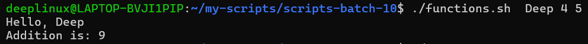
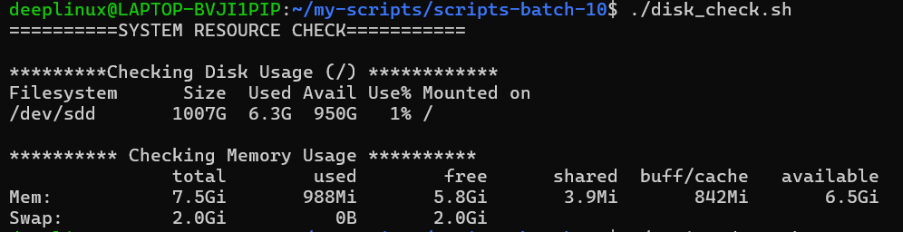
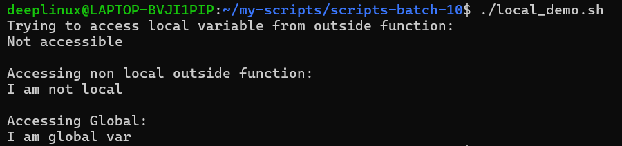
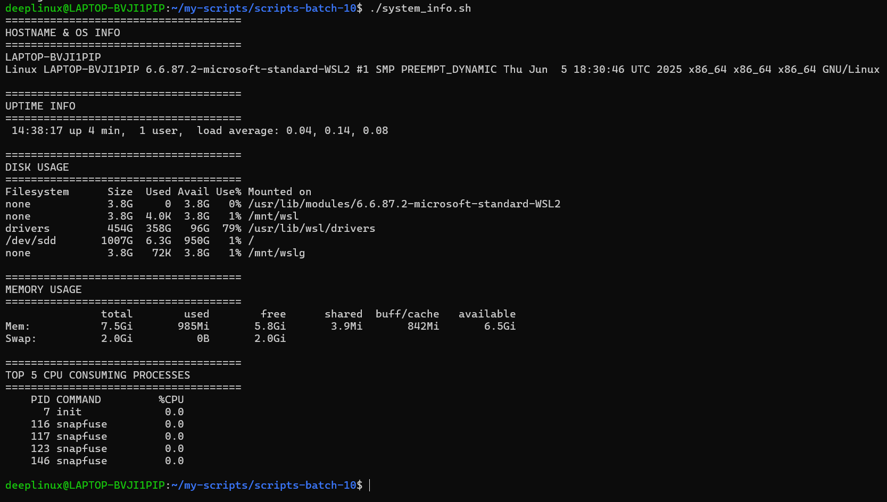

# Day 18 – Shell Scripting: Functions & Intermediate Concepts

## Objective

- Write reusable functions
- Use strict mode (`set -euo pipefail`)
- Work with return values and local variables
- Build a structured production-style script

---

# Task 1 – Basic Functions

## functions.sh

```bash
#!/bin/bash

greet() {
    local name="$1"
    echo "Hello, ${name}!"
}

add() {
    local num1="$1"
    local num2="$2"
    local sum=$((num1 + num2))
    echo "Sum: ${sum}"
}

greet "Deepanshu"
add 10 20
```

### Output



---

# Task 2 – Disk & Memory Check

## disk_check.sh

```bash
#!/bin/bash

check_disk() {
    echo "Disk Usage (/):"
    df -h /
}

check_memory() {
    echo "Memory Usage:"
    free -h
}

main() {
    echo "===== SYSTEM RESOURCE CHECK ====="
    check_disk
    echo
    check_memory
}

main
```

## Output



---

# Task 3 – Strict Mode

## strict_demo.sh

```bash
#!/bin/bash
set -euo pipefail

echo "Testing strict mode..."

# set -u example
echo "${UNDEFINED_VAR}"

# set -e example
false

# set -o pipefail example
cat missingfile.txt | grep "text"
```

## Explanation of Strict Mode

```
set -e        → Exit immediately if a command fails (non-zero exit code)
set -u        → Exit if an undefined variable is used
set -o pipefail → Fail the entire pipeline if any command inside it fails
```

### Why It Matters

Without strict mode:
- Errors are ignored
- Pipes can hide failures
- Typos cause silent bugs

With strict mode:
- Fail fast behavior
- Safer automation
- Production-safe scripting


---

# Task 4 – Local Variables

## local_demo.sh

```bash
#!/bin/bash

global_var="I am global"

use_local() {
    local local_var="I am local"
    echo "Inside function: $local_var"
}

use_global_style() {
    not_local="I leak outside"
}

use_local
echo "Outside function local_var: ${local_var:-Not accessible}"

use_global_style
echo "Outside function not_local: $not_local"
```

## Output



---

# Task 5 – System Info Reporter (Production-Safer Version)

## system_info.sh

```bash
#!/bin/bash
set -euo pipefail

print_header() {
    echo "====================================="
    echo "$1"
    echo "====================================="
}

system_info() {
    print_header "HOSTNAME & OS INFO"
    hostname
    uname -a
    echo
}

uptime_info() {
    print_header "UPTIME"
    uptime
    echo
}

disk_usage() {
    print_header "FILESYSTEM USAGE (TOP 5)"
    df -h | head -n 5
    echo
}

memory_usage() {
    print_header "MEMORY USAGE"
    free -h
    echo
}

top_processes() {
    print_header "TOP 5 CPU CONSUMING PROCESSES"
    ps -eo pid,comm,%cpu --sort=-%cpu | head -n 6
    echo
}

main() {
    system_info
    uptime_info
    disk_usage
    memory_usage
    top_processes
}

main
```

## Output



---

# What I Learned (3 Key Points)

1. Functions make scripts modular and maintainable.
2. `set -euo pipefail` prevents silent failures and improves production safety.
3. Using `df` instead of `du` for system reporting avoids heavy disk scans.

---

# Summary

Day 18 focused on writing cleaner, safer, and more production-ready shell scripts using:

- Functions
- Strict mode
- Local variables
- Structured script design
- Safe filesystem reporting with `df`

This is foundational for real DevOps automation and production system health scripts.