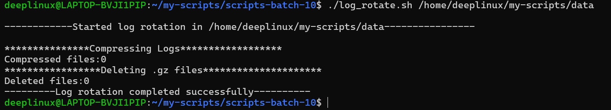
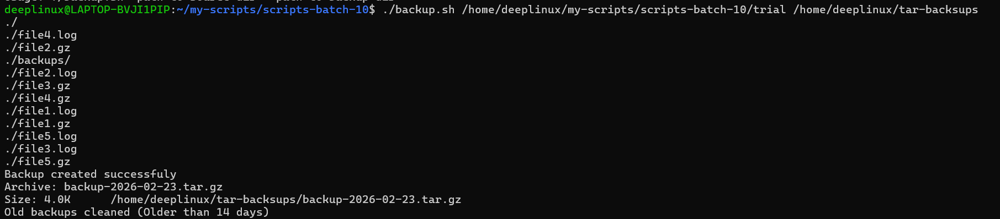
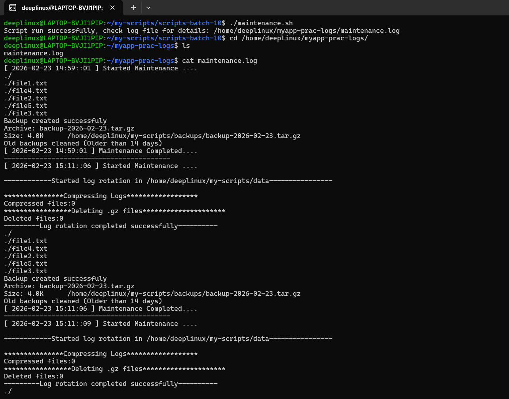

# Day 19 – Shell Scripting Project  
## Log Rotation, Backup & Crontab

---

# 1️⃣ Log Rotation Script

## Script: `log_rotate.sh`

```bash
#!/bin/bash

set -e

LOG_DIR="$1"

if [ -z "$LOG_DIR" ]; then
    echo "Usage: $0 <log_directory>"
    exit 1
fi

if [ ! -d "$LOG_DIR" ]; then
    echo "Error: Directory does not exist: $LOG_DIR"
    exit 1
fi

echo "Starting log rotation in: $LOG_DIR"

COMPRESS_COUNT=$(find "$LOG_DIR" -type f -name "*.log" -mtime +7 | wc -l)

find "$LOG_DIR" -type f -name "*.log" -mtime +7 -exec gzip {} \;

DELETE_COUNT=$(find "$LOG_DIR" -type f -name "*.gz" -mtime +30 | wc -l)

find "$LOG_DIR" -type f -name "*.gz" -mtime +30 -delete

echo "Compressed files: $COMPRESS_COUNT"
echo "Deleted files: $DELETE_COUNT"
echo "Log rotation completed successfully."
```

---

## Sample Output

```
Starting log rotation in: /var/log/myapp
Compressed files: 5
Deleted files: 2
Log rotation completed successfully.

```

---

# 2️⃣ Server Backup Script

## Script: `backup.sh`

```bash
#!/bin/bash

set -e

SOURCE_DIR="$1"
DEST_DIR="$2"
DATE=$(date +%Y-%m-%d)
ARCHIVE_NAME="backup-$DATE.tar.gz"

if [ -z "$SOURCE_DIR" ] || [ -z "$DEST_DIR" ]; then
    echo "Usage: $0 <source_directory> <backup_destination>"
    exit 1
fi

if [ ! -d "$SOURCE_DIR" ]; then
    echo "Error: Source directory does not exist: $SOURCE_DIR"
    exit 1
fi

mkdir -p "$DEST_DIR"

tar -czf "$DEST_DIR/$ARCHIVE_NAME" -C "$SOURCE_DIR" .

if [ ! -f "$DEST_DIR/$ARCHIVE_NAME" ]; then
    echo "Error: Backup archive was not created."
    exit 1
fi

FILE_SIZE=$(du -h "$DEST_DIR/$ARCHIVE_NAME" | cut -f1)

echo "Backup created successfully:"
echo "Archive: $ARCHIVE_NAME"
echo "Size: $FILE_SIZE"

find "$DEST_DIR" -type f -name "backup-*.tar.gz" -mtime +14 -delete

echo "Old backups cleaned (older than 14 days)."
```

---

## Sample Output

```
Backup created successfully:
Archive: backup-2026-02-08.tar.gz
Size: 120M
Old backups cleaned (older than 14 days).
```

---

# 3️⃣ Combined Maintenance Script

## Script: `maintenance.sh`

```bash
#!/bin/bash

LOG_FILE="/var/log/maintenance.log"

LOG_DIR="/var/log/myapp"
SOURCE_DIR="/var/www"
DEST_DIR="/backups"

echo "[$(date '+%Y-%m-%d %H:%M:%S')] Starting maintenance..." >> "$LOG_FILE"

# Run log rotation
/absolute/path/log_rotate.sh "$LOG_DIR" >> "$LOG_FILE" 2>&1

# Run backup
/absolute/path/backup.sh "$SOURCE_DIR" "$DEST_DIR" >> "$LOG_FILE" 2>&1

echo "[$(date '+%Y-%m-%d %H:%M:%S')] Maintenance completed." >> "$LOG_FILE"
echo "--------------------------------------------------" >> "$LOG_FILE"
```

---

## Sample `/var/log/maintenance.log`

```
[2026-02-08 01:00:00] Starting maintenance...
Starting log rotation in: /var/log/myapp
Compressed files: 3
Deleted files: 1
Log rotation completed successfully.
Backup created successfully:
Archive: backup-2026-02-08.tar.gz
Size: 120M
Old backups cleaned (older than 14 days).
[2026-02-08 01:02:14] Maintenance completed.
--------------------------------------------------
```

---

# 4️⃣ Cron Entries

## Check Existing Jobs

```bash
crontab -l
```

---

## Cron Jobs Added

### Run log rotation daily at 2 AM

```bash
0 2 * * * /absolute/path/log_rotate.sh /var/log/myapp >> /var/log/log_rotate_cron.log 2>&1
```

### Run backup every Sunday at 3 AM

```bash
0 3 * * 0 /absolute/path/backup.sh /var/www /backups >> /var/log/backup_cron.log 2>&1
```

### Run health check every 5 minutes

```bash
*/5 * * * * /absolute/path/health_check.sh >> /var/log/health_check.log 2>&1
```

### Run maintenance script daily at 1 AM

```bash
0 1 * * * /absolute/path/maintenance.sh
```

---

# Output Screenshot





---

# 5️⃣ What I Learned (3 Key Points)

### 1. Automation Requires Error Handling
Always validate inputs and check if directories exist. Production scripts must fail safely.

### 2. Cron Requires Absolute Paths
Cron does not use your interactive shell environment. Always use full paths and redirect logs.

### 3. Log Rotation & Backups Need Retention Policies
Without cleanup policies (`-mtime +X`), disks will eventually fill up and crash servers.
