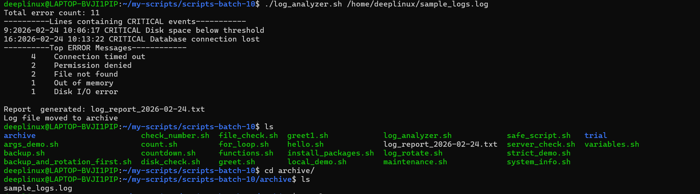
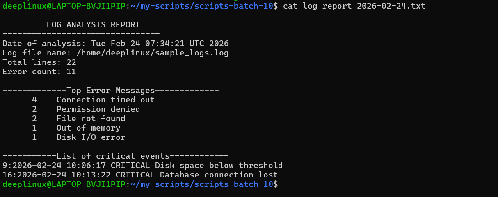

# Day 20 – Bash Scripting Challenge  
## Log Analyzer and Report Generator

---

## 📌 Overview

In this task, I created a Bash script named **log_analyzer.sh** to automate log file analysis.

The script performs the following:

- Accepts a log file path as a command-line argument
- Validates input and file existence
- Counts lines containing `ERROR` or `Failed`
- Extracts `CRITICAL` events with line numbers
- Identifies the Top 5 most common error messages
- Generates a structured summary report
- Archives the processed log file

---

# 🛠 Script: log_analyzer.sh

```bash

#!/bin/bash


DATE="$(date +%Y-%m-%d)"
REPORT_FILE="log_report_${DATE}.txt"

#Taking path to log file as cmd-line argument

log_file="$1"
if [ $# -ne 1 ];then
        echo "ERROR:No argumnet provided - <path to log file>"
        exit 1
fi

if [ ! -f "${log_file}" ];then
        echo "ERROR: File doesn't exists"
        exit 1
fi


error_count=$(grep -Ec "ERROR|Failed" "${log_file}")
echo "Total error count: ${error_count}"


critical=$(grep -n "CRITICAL" "${log_file}")
echo "----------Lines containing CRITICAL events-----------"
echo "${critical}"


top_errors=$(grep "ERROR" "${log_file}" | awk '{$1=$2=$3="";print}' | sort | uniq -c | sort -rn | head -5)
echo "----------Top ERROR Messages------------"
echo "${top_errors}"


{
        echo "--------------------------------"
        echo "         LOG ANALYSIS REPORT          "
        echo "--------------------------------"
        echo "Date of analysis: $(date)"
        echo "Log file name: ${log_file}"
        echo "Total lines: $(wc -l < "${log_file}")"
        echo "Error count: ${error_count}"
        echo ""
        echo "-------------Top Error Messages-------------"
        echo "${top_errors}"
        echo ""
        echo "-----------List of critical events------------"
        echo "${critical}"
} > "${REPORT_FILE}"

echo ""
echo "Report  generated: ${REPORT_FILE}"


ARCHIVE_DIR="archive"
mkdir -p "${ARCHIVE_DIR}"
mv "${log_file}" "$ARCHIVE_DIR/"
echo "Log file moved to ${ARCHIVE_DIR}"

```

---

# ▶️ How to Run

    chmod +x log_analyzer.sh
    ./log_analyzer.sh sample_logs.log

---

# 🖥 Sample Console Output

    Total error count: 11
    ---------- Lines containing CRITICAL events -----------
    9:2026-02-24 10:06:17 CRITICAL Disk space below threshold
    16:2026-02-24 10:13:22 CRITICAL Database connection lost

    ---------- Top ERROR Messages ------------
    4    Connection timed out
    2    Permission denied
    2    File not found
    1    Out of memory
    1    Disk I/O error

    Report generated: log_report_2026-02-24.txt
    Log file moved to archive

---

# 📄 Sample Generated Report (log_report_YYYY-MM-DD.txt)

    --------------------------------
             LOG ANALYSIS REPORT
    --------------------------------
    Date of analysis: Mon Feb 24 15:10:32 UTC 2026
    Log file name: sample_logs.log
    Total lines: 20
    Error count: 11

    ------------- Top Error Messages -------------
    4    Connection timed out
    2    Permission denied
    2    File not found
    1    Out of memory
    1    Disk I/O error

    ----------- List of Critical Events ------------
    9:2026-02-24 10:06:17 CRITICAL Disk space below threshold
    16:2026-02-24 10:13:22 CRITICAL Database connection lost

---

# 📂 Directory Structure After Execution

    scripts-batch-10/
    │
    ├── log_analyzer.sh
    ├── log_report_2026-02-24.txt
    ├── archive/
    │   └── sample_logs.log

---

# Sample Output




---

# 🔧 Commands and Tools Used

### 1. grep
- Count matches: `grep -Ec "ERROR|Failed"`
- Print with line numbers: `grep -n "CRITICAL"`

### 2. awk
Used to remove timestamp fields and extract clean error messages.

### 3. sort
Sorts log entries before frequency counting.

### 4. uniq -c
Counts repeated error messages.

### 5. head -5
Limits output to top 5 results.

### 6. wc -l
Counts total number of lines efficiently using:

    wc -l < file

### 7. mkdir -p
Creates archive directory safely.

### 8. mv
Moves processed log file to archive.

---

# 📚 What I Learned (3 Key Points)

### 1️⃣ Powerful Log Analysis with Pipelines
Combining tools like `grep`, `awk`, `sort`, and `uniq` enables efficient log processing directly in Linux.

### 2️⃣ Importance of Input Validation
Validating arguments and file existence prevents runtime errors and makes scripts reliable.

### 3️⃣ Efficient Redirection and Command Substitution
Using:

    wc -l < file

is more efficient than:

    cat file | wc -l

Understanding redirection improves performance and correctness.

---

# ✅ Conclusion

This challenge strengthened practical skills in:

- Bash scripting
- Linux text processing tools
- Log file analysis
- Report generation
- File handling and archiving

This reflects real-world DevOps log inspection practices used in Linux production environments.