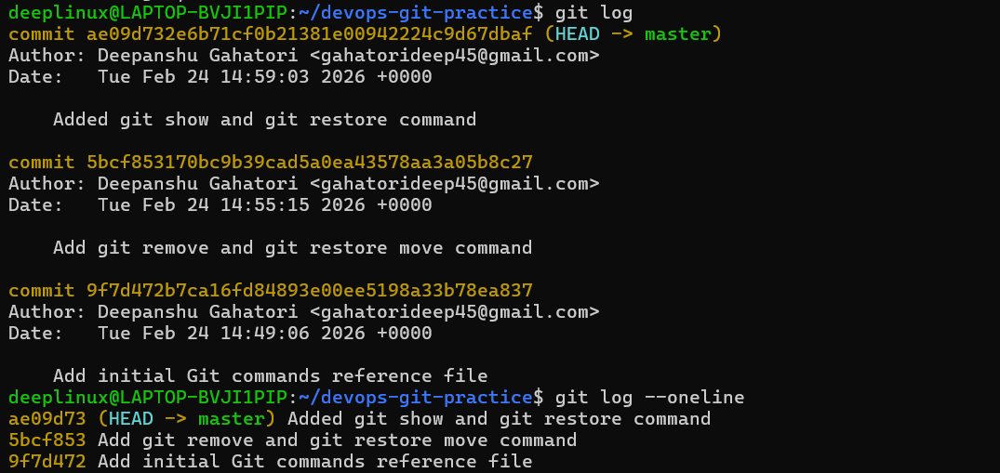

# Day 22 – Introduction to Git: Your First Repository

## 📌 Overview

Today I started my Git journey and built my first local Git repository.  
I practiced initializing a repository, staging changes, committing properly, and maintaining a clean commit history.

---

# ✅ Task 1 – Install and Configure Git

## Verify Git Installation

```bash
git --version
```

## Configure Git Identity

```bash
git config --global user.name "Your Name"
git config --global user.email "your@email.com"
```

## Verify Configuration

```bash
git config --list
```

---

# ✅ Task 2 – Create Git Project

## Create Project Folder

```bash
mkdir devops-git-practice
cd devops-git-practice
```

## Initialize Repository

```bash
git init
```

## Check Repository Status

```bash
git status
```

## Explore .git Directory

```bash
ls -la
ls -la .git
```

---

# ✅ Task 3 – Git Commands Reference File

Created a file:

```bash
touch git-commands.md
```

This file contains categorized Git commands:

## Setup & Config
- git --version
- git config --global user.name
- git config --global user.email

## Basic Workflow
- git init
- git status
- git add
- git commit

## Viewing Changes
- git log
- git log --oneline
- git diff

This file will be updated daily as I learn more Git commands.

---

# ✅ Task 4 – Stage and Commit

## Stage File

```bash
git add git-commands.md
```

## Verify Staged Changes

```bash
git status
```

## Commit Changes

```bash
git commit -m "Add initial Git commands reference file"
```

## View Commit History

```bash
git log
```

---

# ✅ Task 5 – Build Commit History

Repeated the following process multiple times:

```bash
git status
git diff
git add git-commands.md
git commit -m "Add additional Git commands"
```

Viewed compact history:

```bash
git log --oneline
```

Maintained clean, meaningful commit messages.

---

# 📸 Screenshot

Attached screenshot of:

```
git log --oneline
```

Showing multiple descriptive commits.



---

# ✅ Task 6 – Day 22 Notes

## 1️⃣ Difference Between git add and git commit

- `git add` moves changes to the staging area.
- `git commit` permanently records staged changes into the repository history.

---

## 2️⃣ What is the Staging Area?

The staging area allows selective commits.  
It lets developers choose exactly what goes into a commit instead of committing everything automatically.

This prevents accidental or messy commits.

---

## 3️⃣ What Does git log Show?

- Commit ID (SHA)
- Author
- Email
- Date
- Commit message

It provides the full project history.

---

## 4️⃣ What is the .git Folder?

The `.git` folder contains:
- Commit history
- Branch references
- Configuration
- Git metadata

If deleted, the repository loses all version history and becomes a normal folder.

---

## 5️⃣ Working Directory vs Staging Area vs Repository

Working Directory:
Where files are created and modified.

Staging Area:
Intermediate layer where selected changes are prepared for commit.

Repository:
The Git database inside `.git` that permanently stores committed changes.

---

# 🚀 Key Learnings

- Understood Git workflow:  
  Working Directory → Staging Area → Commit → History

- Learned how to maintain clean commit history
- Understood importance of structured commits
- Built a foundation for branching and CI/CD workflows

