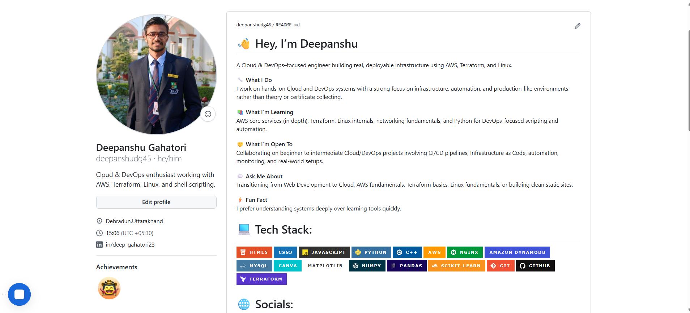
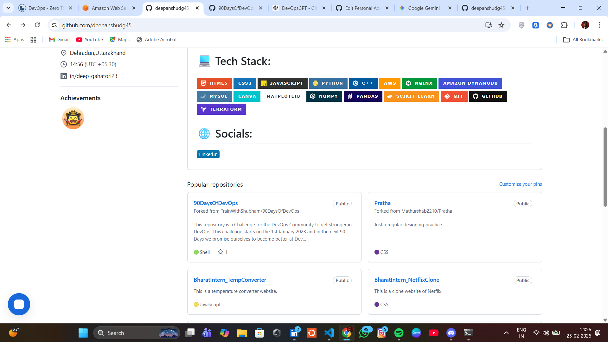
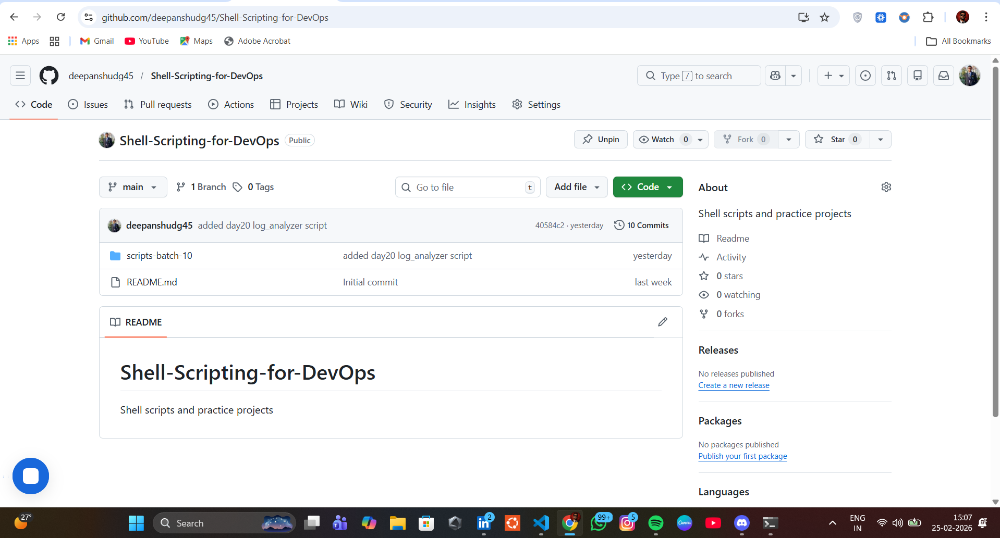
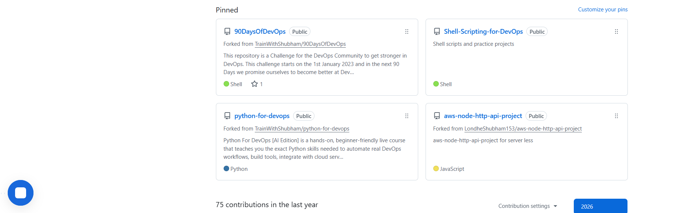
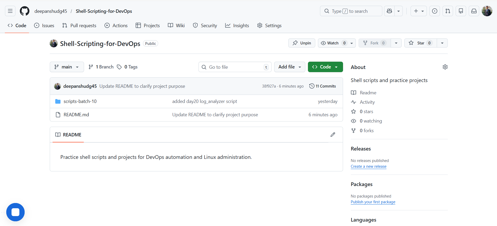

# Day 27 – GitHub Profile Makeover

## 📌 Overview

Today I treated my GitHub profile as a professional portfolio instead of just a code storage space.

I improved clarity, organization, and DevOps positioning.

---

# 🔍 Task 1 – Profile Audit (Before Changes)

## Initial Impression

From an outsider’s perspective:

- Profile picture was professional ✔
- Bio mentioned Cloud & DevOps ✔
- Tech stack section existed ✔
- Some pinned repos were unrelated to DevOps ⚠
- Some repos lacked strong descriptions ⚠
- Older frontend projects were still visible and dominant ⚠

### Would a recruiter understand what I'm working on?

Partially.

They could see DevOps interest, but it was not clearly structured or prioritized.

---

# ✅ Task 2 – Created Profile README

I created a repository with my GitHub username and added a structured README.

### Included:

- Short introduction (Cloud & DevOps learner)
- Currently working on: 90 Days of DevOps
- Core tools:
  - Linux
  - Git & GitHub
  - Shell Scripting
  - Python
  - AWS
  - Terraform
- Links to important repositories
- LinkedIn profile link

### What I Avoided:

- Random widgets
- Long paragraphs
- Unnecessary animations

Goal: Clean, professional, recruiter-friendly.

---

# ✅ Task 3 – Repository Organization

## 1️⃣ 90 Days of DevOps

- Organized by folder (2026/day-XX)
- Clear README explaining the challenge
- Daily structured submissions

---

## 2️⃣ Shell Scripts Repository

- Moved all shell scripts into dedicated repo
- Added README explaining:
  - What each script does
  - Use case
  - How to run

---

## 3️⃣ Python Scripts Repository

- Moved Python practice files
- Added structured README
- Categorized by:
  - Automation
  - Practice
  - Utilities

---

## 4️⃣ DevOps Notes Repository

Created structured notes repo containing:

- Git commands reference
- Shell cheat sheet
- Linux notes
- GitHub CLI notes
- Organized by topic

---

# ✅ Task 4 – Pinned Repositories Updated

Pinned repositories now reflect:

- DevOps learning journey
- AWS-related work
- Git & automation practice
- Structured projects

Removed random frontend practice projects from pinned section.

---

# ✅ Task 5 – Cleanup

- Archived irrelevant repositories
- Renamed unclear repo names
- Ensured no secrets exposed
- Checked commit history for sensitive files
- Verified no .env files committed

---

# 📸 Before Screenshot

# 📸 After Screenshot

---

# 🚀 3 Major Improvements

### 1️⃣ Clear DevOps Identity
Profile now clearly communicates that I am building DevOps skills intentionally.

### 2️⃣ Structured Repositories
Repositories are organized by topic and purpose, not random learning experiments.

### 3️⃣ Professional Presentation
Descriptions, README files, and pinned repos are aligned with career goals.

---

# 🎯 Key Learning

Your GitHub profile is your technical resume.

- Clean structure builds credibility.
- Good documentation builds trust.
- Focused repositories show direction.

From today onward, I treat GitHub as a professional asset.