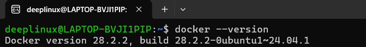
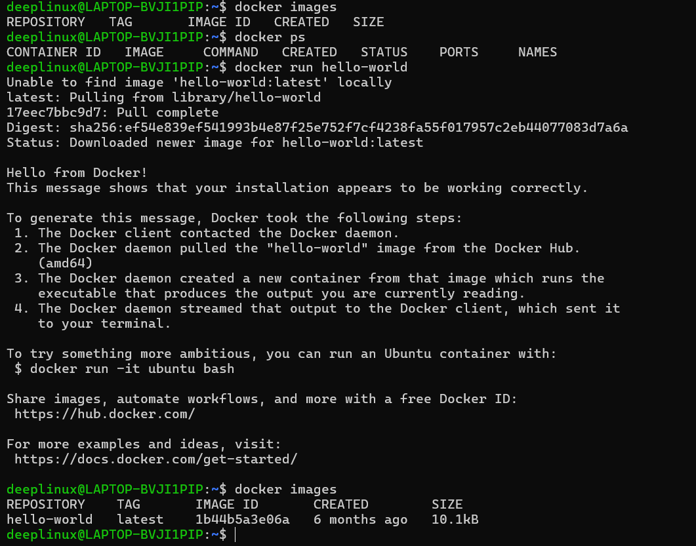
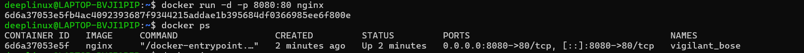
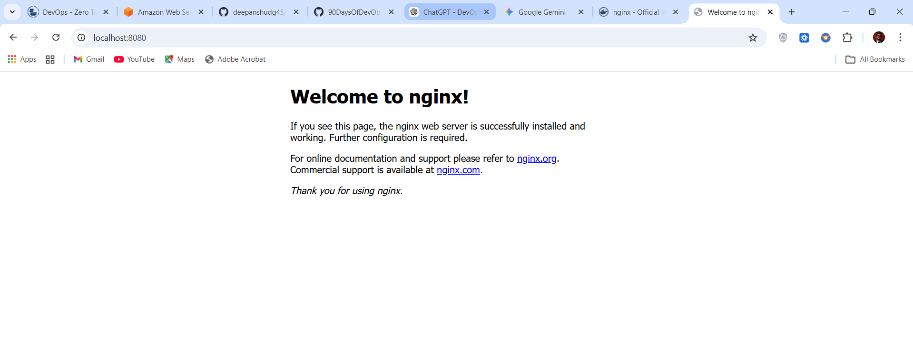
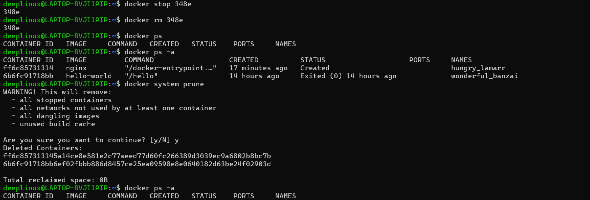
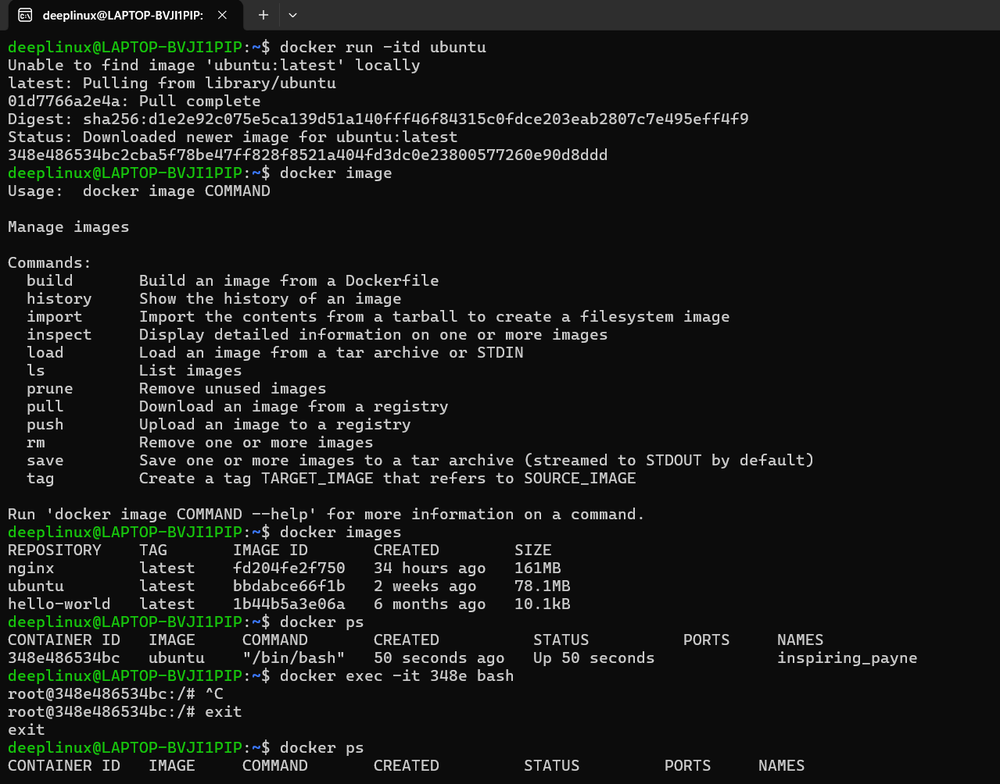
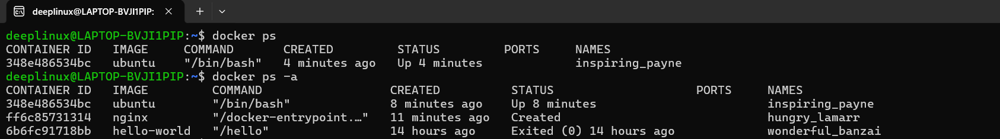

# Day 29 – Docker Basics

## Overview

Today I learned what Docker is, how containers work, how they differ from virtual machines, and how to run and manage containers practically.

---

# Task 1 – What is Docker?

## What is a Container?

A container is a lightweight, portable package that includes:

- Application code
- Runtime
- Dependencies
- Libraries
- System tools

Containers solve the problem:

"It works on my machine but not in production."

They share the host OS kernel but run in isolated environments.

---

## Containers vs Virtual Machines

### Virtual Machines

Architecture:

Hardware  
→ Hypervisor  
→ Guest OS  
→ Application  

Characteristics:

- Each VM has its own OS
- Heavy (GBs in size)
- Slower boot time
- High resource usage

---

### Containers

Architecture:

Hardware  
→ Host OS  
→ Docker Engine  
→ Containers  

Characteristics:

- Share host OS kernel
- Lightweight (MBs)
- Start in seconds
- Low resource usage

---

## Docker Architecture

Docker uses client-server architecture.

Components:

- Docker Client (CLI)
- Docker Daemon
- Docker Images
- Docker Containers
- Docker Registry (Docker Hub)

Flow:

User → Docker CLI → Docker Daemon → Image → Container  
Images are pulled from Docker Hub.

---

# Task 2 – Install Docker

## Step 1 – Install Docker

```bash
sudo apt update
sudo apt install docker.io -y
```

---

## Step 2 – Enable and Start Docker

```bash
sudo systemctl enable docker
sudo systemctl start docker
```

---

## Step 3 – Verify Installation

```bash
docker --version
```

### Screenshot



---

## Step 4 – Run Hello World Container

```bash
sudo docker run hello-world
```

What happened:

- Docker checked for image locally
- Pulled image from Docker Hub
- Created container
- Executed container
- Printed output
- Container exited

### Screenshot



---

## Step 5 – Verify Containers

Running containers:

```bash
sudo docker ps
```

All containers (including stopped):

```bash
sudo docker ps -a
```

# Task 3 – Run Real Containers

## Step 1 – Run Nginx Container

```bash
sudo docker run -d -p 8080:80 --name my-nginx nginx
```

Check running containers:

```bash
sudo docker ps
```

### Screenshot



---

## Step 2 – Access Nginx in Browser

Open:

http://localhost:8080

### Screenshot



---

## Step 3 – Check Logs

```bash
sudo docker logs my-nginx
```

## Step 4 – Execute Command Inside Container

```bash
sudo docker exec -it my-nginx bash
```

Inside container:

```bash
ls
cat /etc/os-release
uname -a
```

Exit container:

```bash
exit
```

---

## Step 5 – Stop Container

```bash
sudo docker stop my-nginx
```

### Screenshot



---

## Step 6 – Remove Container

```bash
sudo docker rm my-nginx
```

---

## Step 7 – Run Ubuntu in Interactive Mode

```bash
sudo docker run -it ubuntu bash
```

Inside container:

```bash
apt update
ls
whoami
```

Exit:

```bash
exit
```

### Screenshot



---

# Task 4 – Explore Advanced Options

## 1. Run Container in Detached Mode

```bash
sudo docker run -d nginx
```

---

## 2. Run Container with Custom Name

```bash
sudo docker run -d --name web-server nginx
```

Check:

```bash
sudo docker ps
```

### Screenshot



---

## 3. Port Mapping

```bash
sudo docker run -d -p 9090:80 --name test-nginx nginx
```

Open in browser:

http://localhost:9090

---

## 4. Check Container Logs

```bash
sudo docker logs test-nginx
```

---

## 5. Execute Command in Running Container

```bash
sudo docker exec -it test-nginx bash
```

Inside container:

```bash
apt update
apt install curl -y
curl localhost
```

Exit:

```bash
exit
```

---

# Why Docker Matters for DevOps

Docker is the foundation of:

- CI/CD pipelines
- Kubernetes
- Microservices
- Cloud-native applications

Containers allow consistent, fast, and scalable deployments across environments.

---

# Submission Steps

```bash
git add 2026/day-29/day-29-docker-basics.md
git commit -m "Day 29 - Docker Basics"
git push origin main
```