# Day 30 – Docker Images & Containers

---

# Task 1 – Docker Images

## 1. Pull Required Images

```bash
docker pull nginx
docker pull ubuntu
docker pull alpine
```

## 2. List All Images and Check Sizes

```bash
docker images
```

## 3. Compare Ubuntu vs Alpine

- Ubuntu is a full Linux distribution.
- Alpine is a minimal distribution designed for containers.
- Alpine uses musl libc (smaller footprint).
- Ubuntu includes more libraries and tools.
- Alpine images are significantly smaller.
- Smaller images mean faster downloads and reduced attack surface.

## 4. Inspect an Image

```bash
docker inspect nginx
```

Check:
- Image ID
- Created time
- Architecture
- OS
- Exposed ports
- Default CMD

## 5. Remove an Image

```bash
docker rmi ubuntu
```

Force remove (if required):

```bash
docker rmi -f ubuntu
```

---

### 📸 Screenshot (Single Output for Task 1)

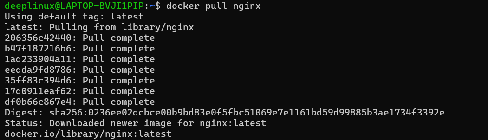
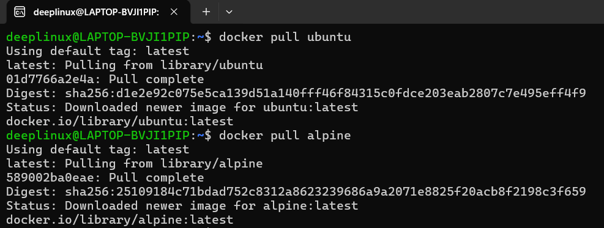
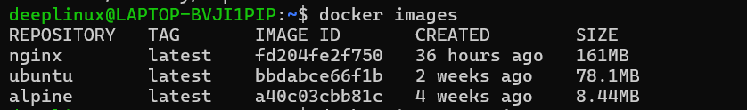
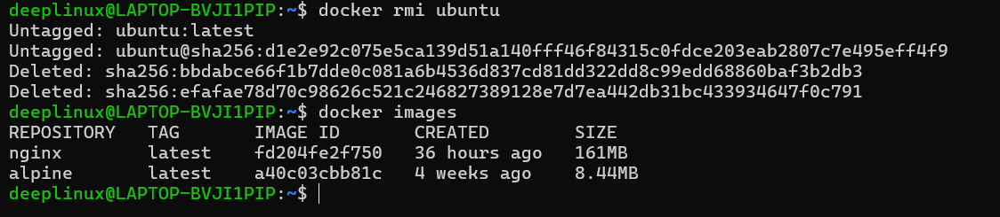

---

# Task 2 – Image Layers

## 1. View Image History

```bash
docker image history nginx
```

## 2. Observations

- Each line represents one layer.
- RUN commands create filesystem layers.
- ENV, CMD, WORKDIR may show 0B.
- Layers are stacked on top of each other.
- Base image forms the bottom layer.
- Layers are cached during builds.

## 3. Why Docker Uses Layers

- Faster rebuilds using caching
- Shared layers between images
- Efficient storage
- Reduced network transfer
- Easier image version control

---

### 📸 Screenshot (Single Output for Task 2)

Take one screenshot showing:
1. docker image history nginx
2. Multiple layers listed
3. At least one layer showing size
4. At least one layer showing 0B
5. Layer creation timestamps visible

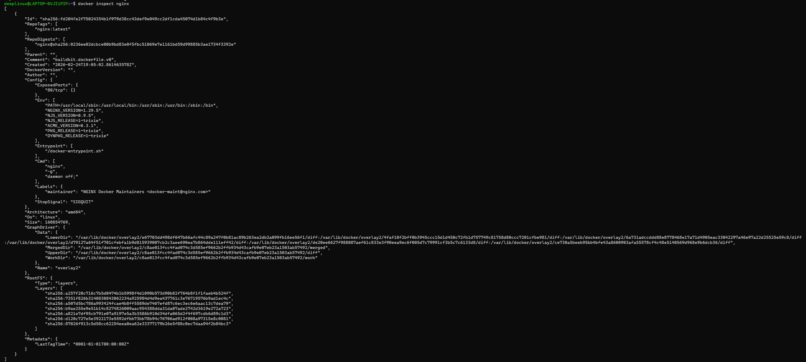

---

# Task 3 – Container Lifecycle

## 1. Create Container (Without Starting)

```bash
docker create --name mynginx nginx
docker ps -a
```

## 2. Start Container

```bash
docker start mynginx
docker ps
```

## 3. Pause and Unpause

```bash
docker pause mynginx
docker unpause mynginx
```

## 4. Stop Container

```bash
docker stop mynginx
```

## 5. Restart Container

```bash
docker restart mynginx
```

## 6. Kill and Remove

```bash
docker kill mynginx
docker rm mynginx
```

Key Learnings:
- create ≠ start
- stop = graceful shutdown (SIGTERM)
- kill = force stop (SIGKILL)
- Containers move through states: Created → Running → Paused → Exited
- Containers are ephemeral
- Always verify using docker ps -a

---

### 📸 Screenshot (Single Output for Task 3)

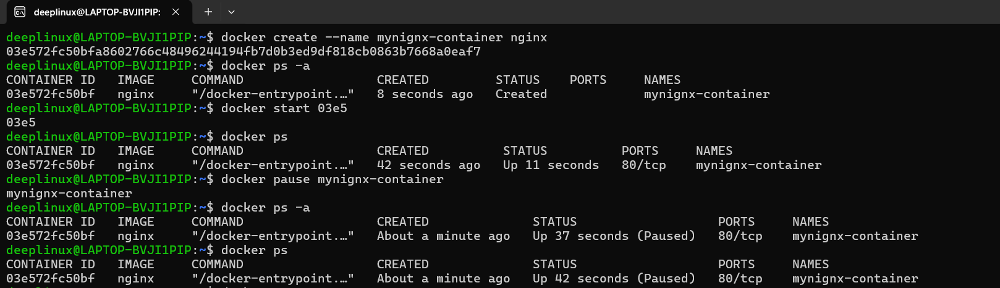
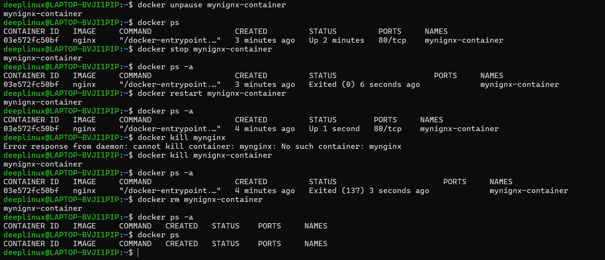

---

# Task 4 – Working with Running Containers

## 1. Run Nginx in Detached Mode

```bash
docker run -d --name web -p 8080:80 nginx
```

Access:
```
http://localhost:8080
```

## 2. View Logs

```bash
docker logs web
```

## 3. View Real-Time Logs

```bash
docker logs -f web
```

## 4. Exec Into Container

```bash
docker exec -it web /bin/bash
```

If bash not available:

```bash
docker exec -it web /bin/sh
```

## 5. Run Single Command Without Entering

```bash
docker exec web ls /
```

## 6. Inspect Container

```bash
docker inspect web
```

Observe:
- IP Address
- Port Bindings
- Mounts
- Container state
- Network configuration
- Entry point command

---

### 📸 Screenshot (Single Output for Task 4)

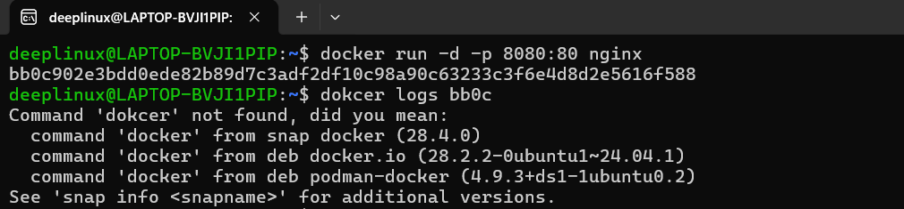
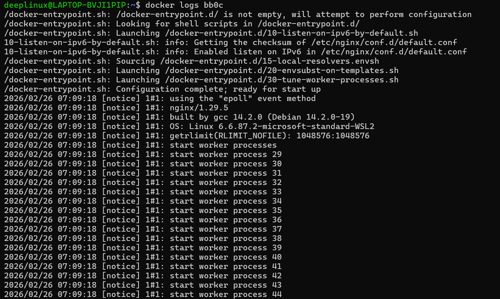
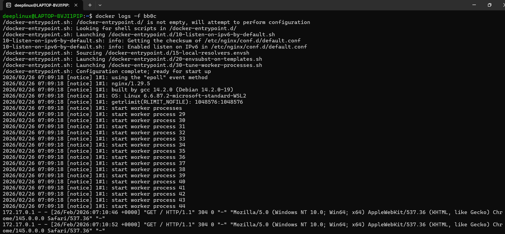
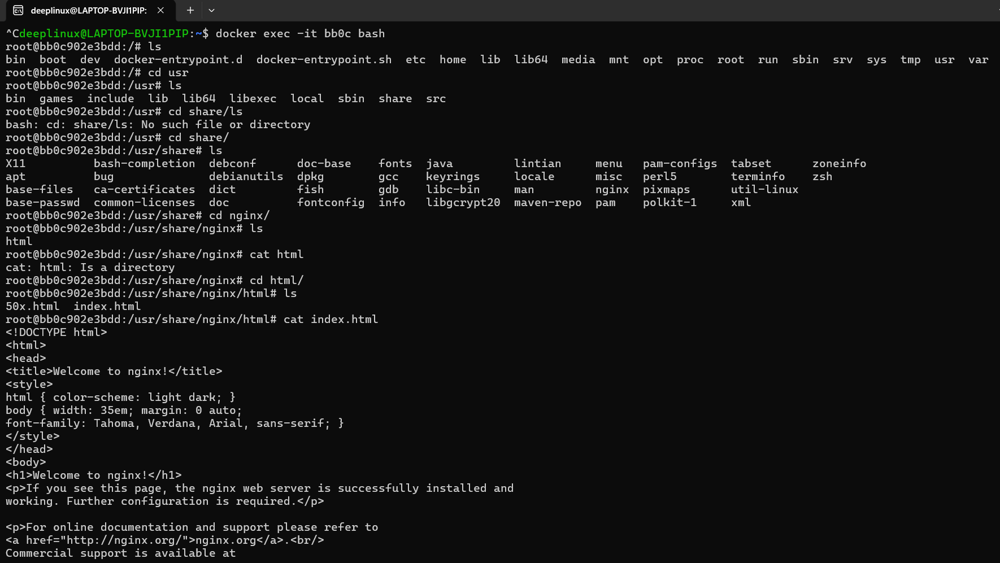
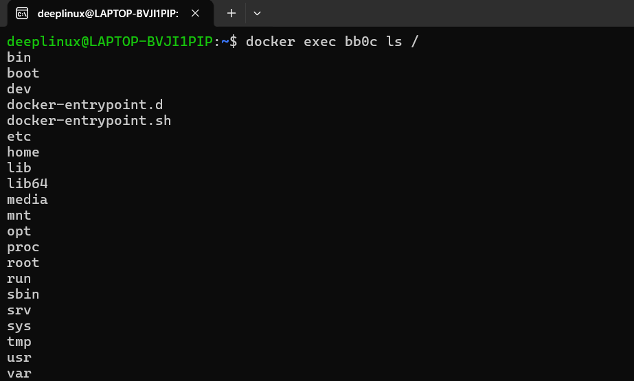
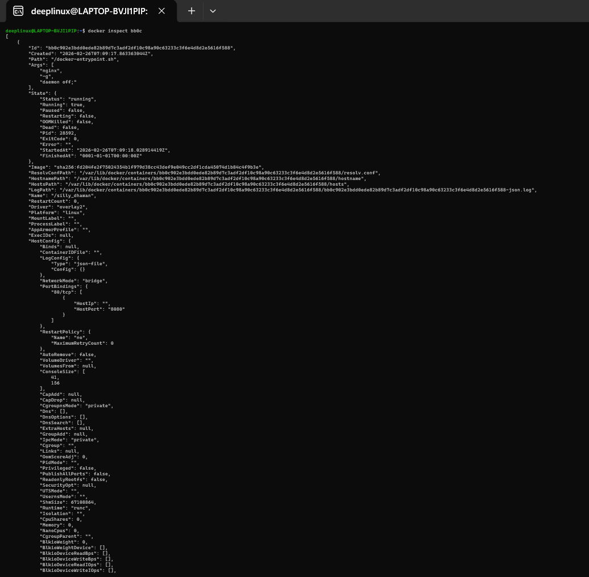
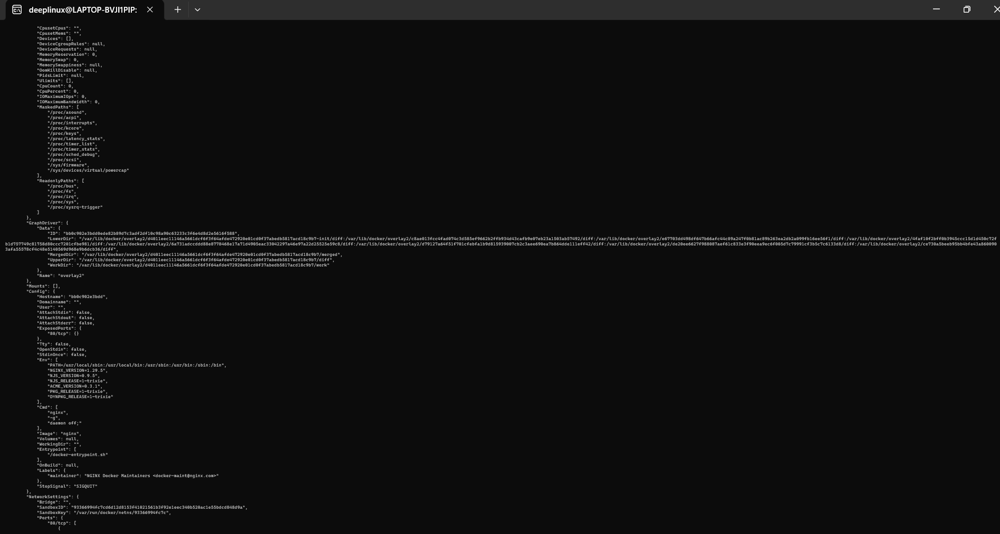
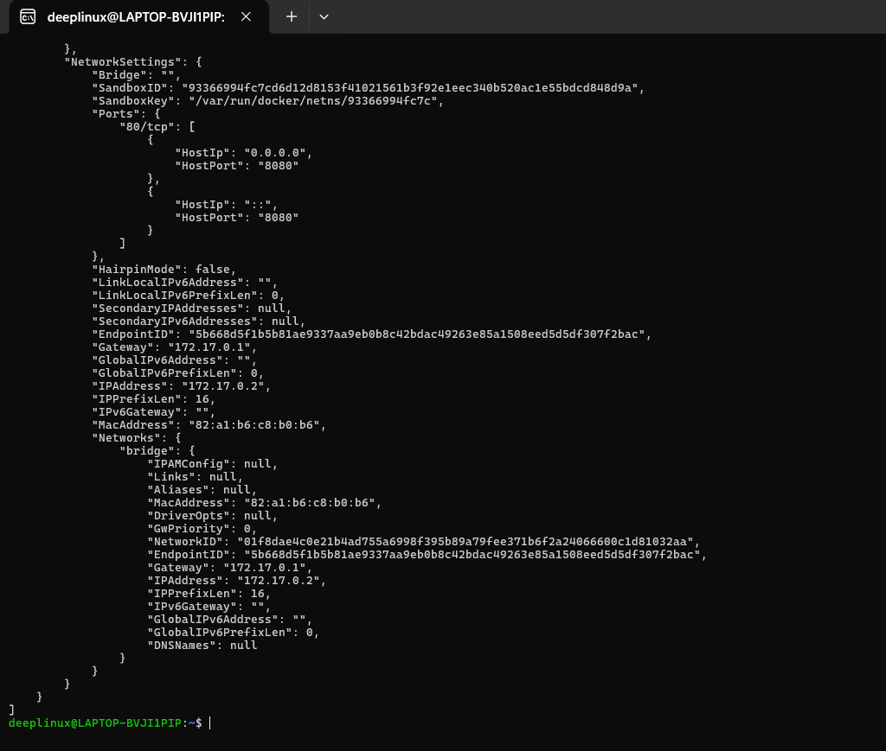


---

# Task 5 – Cleanup

## 1. Stop All Running Containers

```bash
docker stop $(docker ps -q)
```

## 2. Remove All Containers

```bash
docker rm $(docker ps -aq)
```

## 3. Remove Unused Images

```bash
docker image prune
```

## 4. System Cleanup (Use Carefully)

```bash
docker system prune
```

## 5. Check Docker Disk Usage

```bash
docker system df
```

Key Points:
- Always verify before pruning
- Avoid blind cleanup in production
- Monitor disk usage regularly
- Containers should not accumulate
- Build cache can consume space
- Cleanup improves CI performance

---

### 📸 Screenshot (Single Output for Task 5)

Take one screenshot showing:
1. docker stop output
2. docker rm output
3. docker image prune confirmation
4. docker system prune summary
5. docker system df disk usage output
6. docker images showing clean state

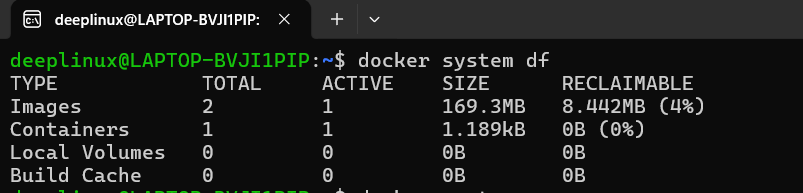
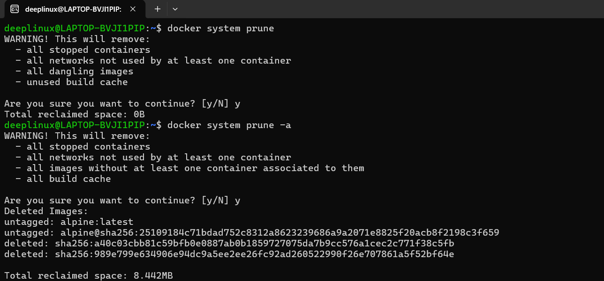
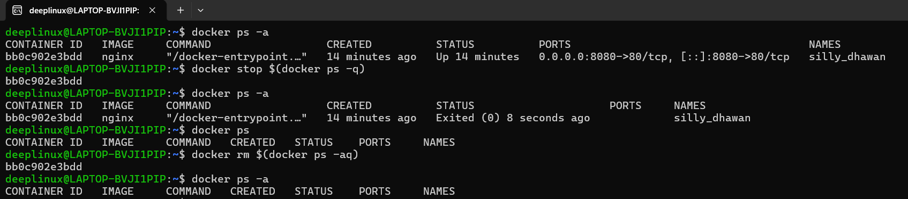
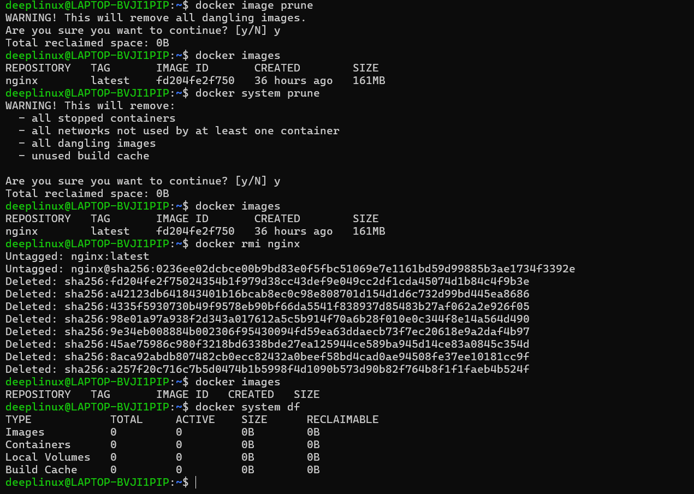

---

# Final Understanding

- Difference between image and container
- What Docker layers are
- Container lifecycle states
- Logging and debugging containers
- Proper cleanup procedures
- Importance of lightweight images in production